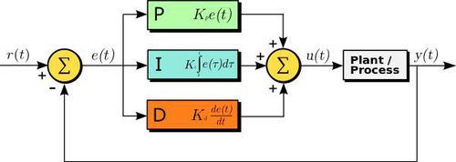
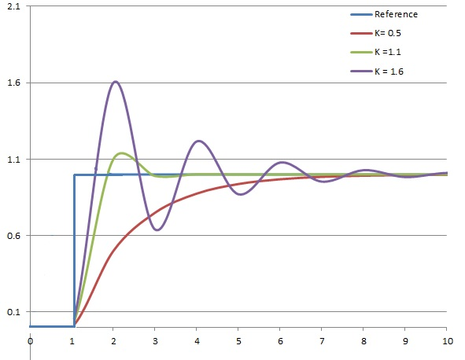
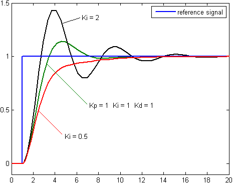
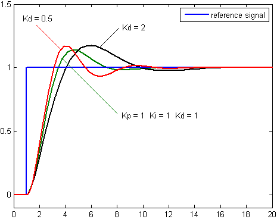
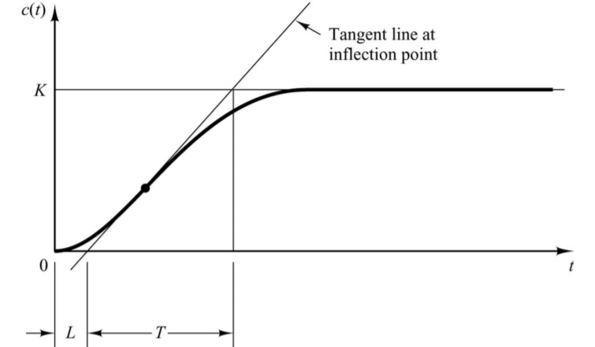
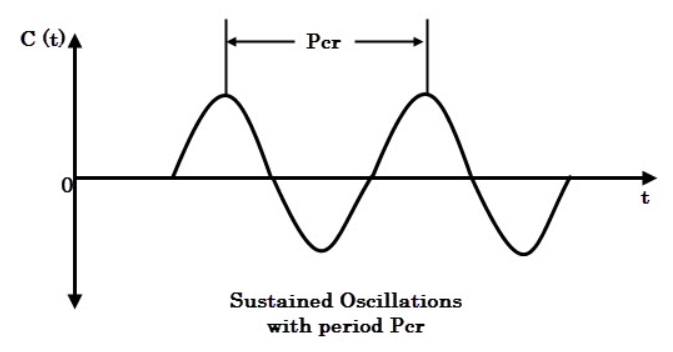
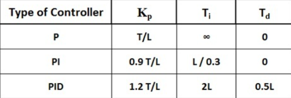

## Linear Control Techniques

Linear Control technique is the most widely used technique for designing control systems in robotics because of its simple implementation when your system is operating in vicinity of a particular point. Some of the common linear control system design techniques, includes the well-known PID control, H2 and H$\infty$ optimal control, linear quadratic regulator (LQR) with loop transfer recovery design (LTR) , and some newly developed design techniques, such as the robust and perfect tracking (RPT) method.

## PID Controller

PID control is the most popular technique used in industries because it is relatively easy and simple to design and implement. Most importantly, it works in most practical situations, although its performance is somewhat limited owing to its restricted structure.

Hence, a PID control law has the following general form for the input command:  
$u(t) = K~p~e(t) + K~i~\int e(t) + K~d~\frac{de(t)}{dt}$  
where $e = q - q~d~$ is the error signal, and $K~p~, K~i~$ and $K~d~$ are positive constant gains associated with proportional, integral, and derivative controllers.

Consider the control system , in which G(s) is the plant to be controlled and K(s) is the PID controller, it can be characterized by the following transfer function:
$K(s) = K~p~(1+\frac{1}{Tis}+Tds)$
The control system design is then to determine the parameters Kp , Ti and Td such that the resulting dosed-loop system yields a certain desired performance, i.e. it meets certain prescribed design specifications.

### Proportional factor

The proportional factor is easiest to understand: The output of the proportional factor is the product of gain and measured error ε. Hence, larger proportional gain or error makes for greater output from the proportional factor. Setting the proportional gain too high causes a controller to repeatedly overshoot the setpoint, leading to oscillation.

The downside to a proportional-only loop is that when error becomes too small, loop output becomes negligible. Therefore, even when the proportional loop reaches steady state, there is still error. The larger the proportional gain, the smaller the steady state error — but the larger the proportional gain, the more likely the loop is to become unstable. This dilemma leads to inevitable steady-state error called *offset*.

### Integral Factor

The main function of an integral control is to eliminate the steady state error and make the system follow the set point at steady state conditions. The integral controller leads to an increasing control command for a positive error, and a decreasing control command for a negative error. The downside to the integral factor is that it strongly contributes to controller output overshoot past the target setpoint. The shorter the integral time, the more aggressively the integral works.

### Derivative Factor

The purpose of derivative control is to improve the closed-loop stability of a system. A derivative controller has a predicting action by extrapolating the error using a tangent to the error curve. The derivative factor is the least understood and used of the three factors. In fact, a majority of PID loops in the real world are really just PI loops. A properly used derivative allows for more aggressive proportional and integral factors.

## PID Tuning Method

The determination of corresponding PID parameter values for getting the optimum performance from the process is called tuning. This is obviously a crucial part in case of all closed loop control systems. There are number of tuning methods have been introduced to obtain fast and acceptable performance.

### Trial and Error Method

This is the simple method of tuning a PID controller. Once we get the clear understanding of PID parameters, the trial and error method become relatively easy.

- Set integral and derivative terms to zero first and then increase the proportional gain until the output of the control loop oscillates at a constant rate. This increase of proportional gain should be in such that response the system becomes faster provided it should not make system unstable.
- Once the P-response is fast enough, set the integral term, so that the oscillations will be gradually reduced. Change this I-value until the steady state error is reduced, but it may increase overshoot.
- Once P and I parameters have been set to a desired values with minimal steady state error, increase the derivative gain until the system reacts quickly to its set point. Increasing derivative term decreases the overshoot of the controller response.

### Zeigler-Nichols Method

It is another popular method for tuning PID controllers. Ziegler and Nichols presented two classical methods for determining values of proportional gain, integral time and derivative time based on transient response characteristics of a given plant or system.

#### First Method

- Obtain a unit step response of the plant experimentally and it may look‘s’ shaped curve as shown in figure below. This method applies, if obtained response exhibit s-shaped curve for unit step input otherwise it cannot be applied. This curve can also be obtained by dynamic simulation of the plant.

- Obtain two constants, delay time L and time constant T by drawing a tangent line at the inflection point of the s-shaped curve.
- Set the parameters of Kp, Ti , and Td values from the table given below for three types of controllers.

#### Second Method

- It is very similar to the trial and error method where integral and derivative terms are set to the zero, i.e., making Ti infinity and Td zero.
- Increase the proportional gain such that the output exhibits sustained oscillations. If the system does not produce sustained oscillations then this method cannot be applied. The gain at which sustained oscillations produced is called as critical gain.

- Once the sustain oscillations are produced, set the values of Ti and Td as per the given table for P, PI and PID controllers based on critical gain and critical period.

