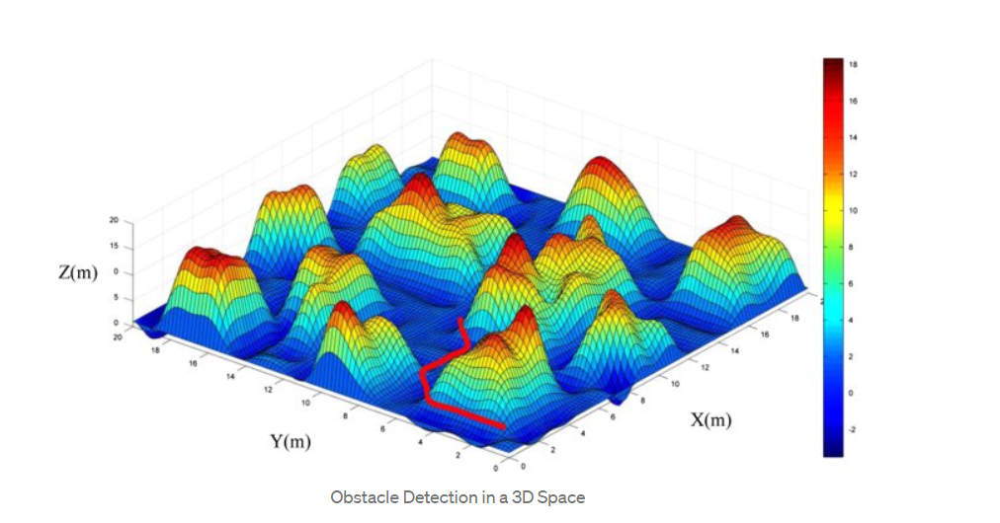
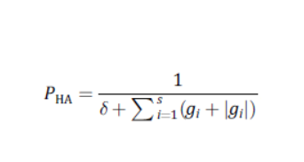
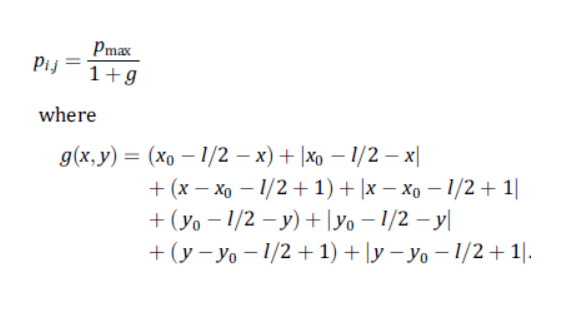
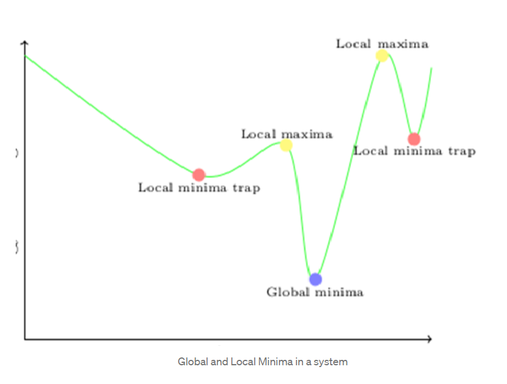

# Artificial Potential Field Algorithm for Path Planning

Over the past few years, research into using robots to reduce human labour has increased. Robotics has emerged as a new field for the benefit of people, from employing mobile robots for military operations on land and underwater to using them in restaurants to prepare food for patrons. Unmanned vehicle course planning and obstacle identification while limiting input energy and obtaining the best outcomes, however, is a significant challenge. The question of how to employ various methods to develop an obstacle distribution model and how to attain the required outcomes while making a few assumptions in a real-world system has been the subject of some recent literary works.

One of the most fundamental and often used algorithms for such a situation is the potential field algorithm. In accordance with the literature sources studied and the outcomes of the experiment done, this paper will provide a quick review of how various algorithms can be employed for path planning reasons as well as how the potential field algorithm aids in obstacle detection.

## Working principle of Potential Field Algorithm

Any physical field that complies with Laplace's equation is a potential field. Electromagnetic, gravitational, and electrical fields are a few typical examples of potential fields. To control a robot's movement within a given area, a potential field algorithm makes use of the artificial potential field. We simplify the division of a space into a grid of cells with obstacles and a goal node.

The potential field functions, which will be discussed further in the explanation, are used by the algorithm to assign an artificial potential field to every point on earth. From the highest potential to the lowest potential, the robot simulates. In this case, the starting node will have the highest potential while the goal node has the lowest potential. Since the UAV moves from lowest to highest potential, we can say that.

## Types Of Potential Fields

Two kinds of artificial potential fields are generated within the system: Attractive field and Repulsive fields.

<center></center>

The goal node exhibits an attractive field while the obstacles in the system produce repulsive fields.

Force of repulsion is inversely proportional to Distance from the robot to obstacles.

Hence, the generated total force at each point of the graph is:

U(total) = U(attraction) + U(repulsion)

#### Attractive Fields
The following function can be used for generating the force generated by the goal node. Here, x and y are the coordinates of the starting node, (xgoal,ygoal) are the coordinates of the goal node and C is a constant.

<center></center>

#### Repulsive Fields

Two kinds of repulsive forces are produced within the system:

**1. Repulsive forces by the boundaries:**
This force remains uniform throughout the system and hence, doesn’t affect the calculations; this force is useful in keeping the robot away from the boundaries. The following equation can be used to find the repulsive forces exhibited by the boundaries:

<center></center>

where gi is a linear function that represents the boundary of the convex region, δ is a constant number with a small value and s is the number of boundary face segments.

**2. Repulsive forces by the obstacles:**
The force of repulsion from obstacles can be calculated through the formula given below. Here, pmax is the highest potential, (x0,y0) are the coordinates of the center of an obstacle and l is the side length of the obstacle:

<center></center>

Hence, the resultant force on the environment is:
P = Po + P(goal) where, Po = max{Pi}

#### Local Minima Trap

The local minima trap problem is a problem for potential field algorithms. This happens when all artificial forces—both attracting and repulsive—are balanced out, as happens, for example, when an obstacle is directly in the path of the UAV or when there are many impediments close together. This problem can be solved in a number of ways. The solution method we employ here introduces a fictitious barrier in the vicinity of the local minima to deter the migrating object.

<center></center>

#### Pseudo Code for Algorithm

```
t=0,xc(0)=xstart,Flag = 0, calculate the potential function
while Next decision is not goal do
    if Flag = 0 then
        Go to the next position with lowest potential
        else if Flag =1 then
            Change the cell weight and treat the cells as occupied by an obstacle
            Update  the potential of each cell.
        end
    end
    if the bot is trapped in a cell or visits the same place multiple times then
        Flag =1,
        searchfor the trapping points/points
    end
    if the bot flees from the local minima then
        Flag = 0,
    end
    X t+! <- cell nearby with lowest potential function
    t <- t+1
end
```
#### Time Complexity of the Algorithm

Evaluation of forces in the configuration space is a requirement of potential field algorithms, and the complexity of these algorithms is frequently O(MD), where M is the total number of nodes in the computation space and D is the dimension of the space. Robot path planning is a good example of this algorithm in use.

### References
[CS765 McGill University Notes](https://www.cs.mcgill.ca/~hsafad/robotics/)