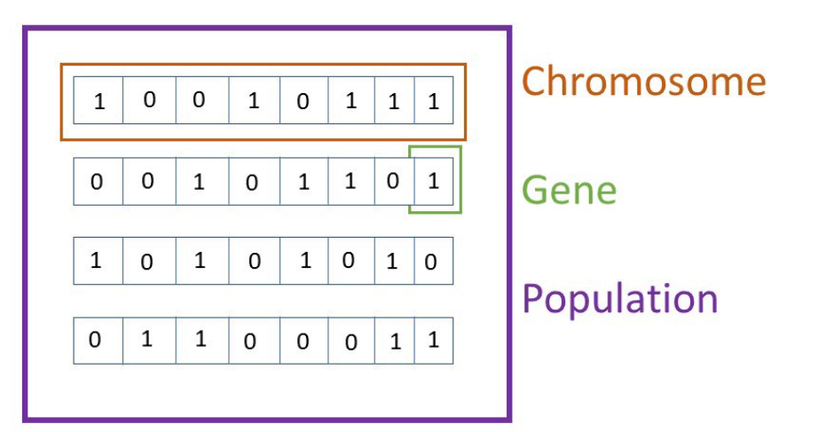
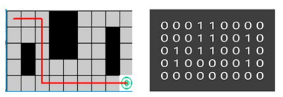
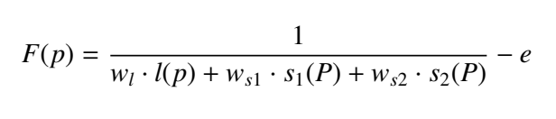
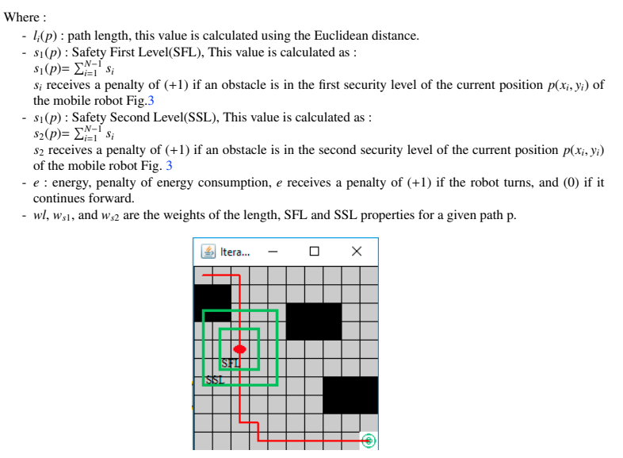

# Genetic Algorithm

The class of evolutionary algorithms that includes genetic algorithms was largely influenced by biological evolution. We are all aware of the basic principles of biological evolution, which include the choice of parents, reproduction, and offspring mutation. To produce offspring that are biologically superior to their parents is the primary goal of evolution. A genetic algorithm attempts to imitate Darwin's Theory of Evolution by Natural Selection. It is based primarily on this theory.

The basic idea is to choose the population's best individuals to serve as parents, then ask them to increase the size of their generation by reproducing and bearing children. However, when genes from both parents cross over during reproduction, this can result in mutations, which are errors that can occur. The process continues, resulting in a healthier generation as these kids are asked to reproduce their babies once more. Evolutionary computation has been used to solve a variety of computational issues, including the traditional knapsack problem, feature selection, and optimization issues.

## Steps in Genetic Algorithm

1. Genetic Representation(Encoding of Chromosomes)
2. Representation of the Environment
3. Initialization of Population
4. Fitness Function
5. Selection Operator
6. Crossover Operator
7. Mutation Operator

In a genetic algorithm, a population of potential solutions to an optimization problem (referred to as individuals, animals, or phenotypes) evolves toward superior solutions. Traditionally, solutions are represented in binary as strings of 0s and 1s, although other encodings are also feasible. Each candidate solution has a set of properties (its chromosomes or genotype) that can be changed and modified.

### The Genetic Representation (Encoding of chromosomes)
Genetic coding of potential members of the original population is necessary for the application of genetic algorithms to a particular problem. The most popular type of encoding employed in GAs was binary. Depending on the issue at hand, many encoding techniques can be employed.
The selection of a coding method is crucial for the success of the behaviour of the GAs because the fitness function and genetic operators have an impact on this coding. The pathways (Positions set) that connect two known positions are potential solutions to the path planning problem (starting point and a target point). This path's nodes must be genuine, that is, they must not correspond to any obstruction. 

### Representation of the Environment

We can apply the occupancy grid presentation  in which the robot environment is represented by 2D matrix,in which each position (x, y) in the grid has
two likely values: 0 for free cells, and 1 for occupied ones. An appropriate solution is a path (set of
positions) from the starting point to the goal point crossing a set of free positions.

### Initialization of Population
As GA begins its searching process for the optimal path by acting on the initial population which is as set of potential candidates, the initialization method is a very important step since it alters
the efficiency of the GA. Hence the choice of an efficient initial population method enhances the GA search
effectiveness.

### Fitness Function
Once the initial population has been established, the GA must assess each member's performance using an adaptive function that gives each potential solution a fitness value that reflects its calibre. The FF must take into account a number of factors, including distance, safety, smoothness, etc. The challenge of defining an appropriate fitness function is vital since the GA uses the data produced by this function to select people for reproduction, mutation, and to select the optimal outcome in the final analysis.Population based on its level of fitness. Four factors need to be considered when the suggested. Path length, Safety First Level (SFL), Safety Second Level (SSL), and energy make up the fitness function. 

### Selection Operator
The selection operator's primary goal is to select people who are highly adaptable for the following generation. The performance of GA is significantly impacted by the selection pressure, which is a crucial requirement [13]. If there is strong selection pressure, the GA converges. A low selection pressure results in random solutions, and fast without fully utilising the search space. In our elitist, which has a high pressure selection, is used to govern the pressure selection in the (TRS) approach.Utilised to give weak chromosomes a chance whereas TRS is used to keep the fittest solutions throughout generations.
To avoid the dominance of the prior generation by choosing individuals from the previous one to reproduce in the present one superior person.

### Crossover Operator
The crossover is used after individuals have been chosen using the selection operator.
"Crossover" is a genetic operator that combines the genes from the two chosen chromosomes (parents) to produce new chromosomes (offspring/child), maintain the population's heterogeneity, and increase the fitness value of potential solutions. Crossover's core tenet is that new chromosomes take the best traits from their parents. The end outcome is a child who does better than both of its parents.
The likelihood of performing a crossover is known as the crossover rate.

### Mutation Operator

A genetic operator called mutation is used to increase diversity and delay the algorithm's premature convergence. Typically, this operator picks a gene at random and replaces it with a new gene that is not already present in the path. However, as stated in random mutation, invalid routes can be produced. Even though a solution is correct prior to the use of the mutation operator, the newly transformed gene may contain a barrier, which causes it to construct an unsuitable path. The mutation operator suggested in this publication is what we use in our study.

### References

* [Github Link](https://github.com/Yaaximus/genetic-algorithm-path-planning)
* [International Journal of Computational Engineering Research](https://citeseerx.ist.psu.edu/viewdoc/download?doi=10.1.1.300.5493&rep=rep1&type=pdf)