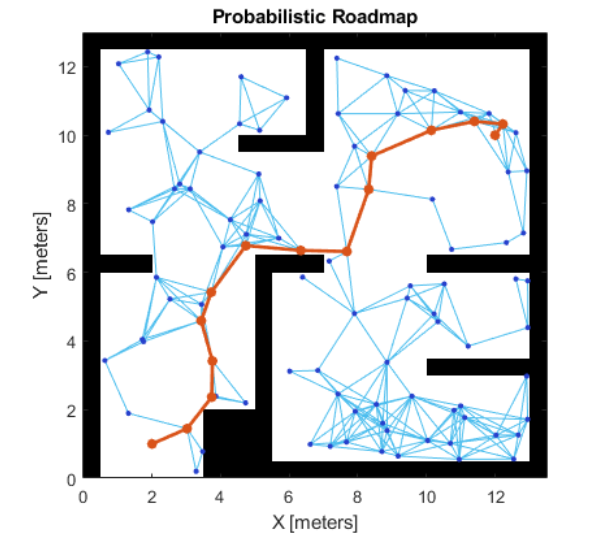
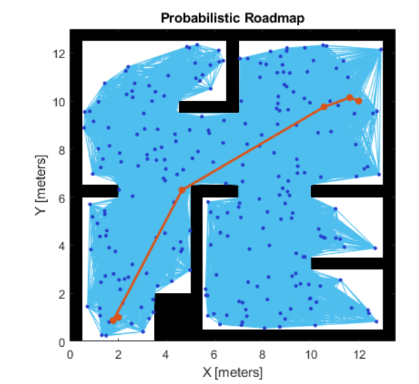
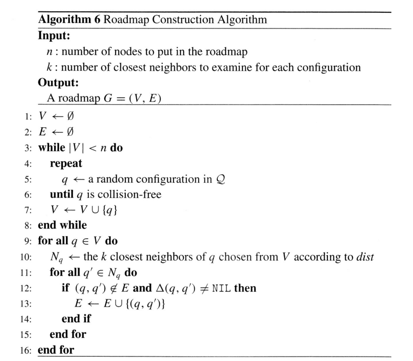
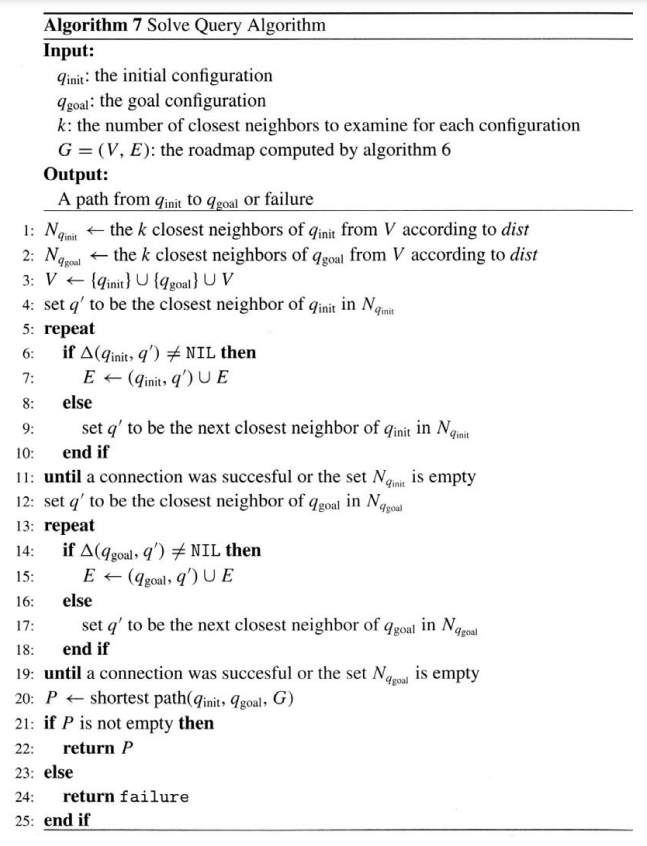

# Probilistic Roadmap Method

A network graph of potential routes in a given map based on open and occupied spaces is known as a probabilistic roadmap (PRM). Based on the PRM algorithm parameters, an object generates nodes at random and connects these nodes. Based on the connection distance  and the obstacle positions indicated in the Map, nodes are connected. The number of nodes can be altered to suit the complexity of the map and your goal to discover the quickest route. To discover a path free of obstacles from a starting point to an ending point, the PRM method makes use of a network of connected nodes. A path through an environment can be properly planned by adjusting the connection distance  and number of nodes attributes.

The node locations are created at random when creating or changing the PRM class, which may have an impact on your final path after several iterations. When you call update, alter the parameters, or specify Map at the beginning, a selection of nodes is made. The state of the random number generation is needed to be preserved to get consistent results with the same node location. 

## Disadvantages of PRM

Although this algorithm is incredibly helpful, it does not always provide the best option. Think about a configuration space where there are several obstacles that are quite close to one another. Assume that there is a very little space between two obstacles. Keep in mind that our system creates nodes at random. As a result, there is extremely little chance of creating nodes between such gaps. If we increase the number of iterations, the algorithm might build nodes in that area.

Though it may seem like it, the problem is not resolved by increasing the number of iterations.
We wouldn't know whether the path doesn't exist or the number of iterations is lower for that environment if the system fails to build a path for such configurations of the space.
This algorithm's only shortcoming is this. In the event of failure, it does not give us a clear image.

## Pseudo Code for Algorithm

## References

* [MATLAB Documentation](https://in.mathworks.com/help/robotics/ug/probabilistic-roadmaps-prm.html)
* [CS CMU paper](https://www.cs.cmu.edu/~motionplanning/papers/sbp_papers/PRM/prmbasic_01.pdf)
* [CS Columbia Notes](https://www.cs.columbia.edu/~allen/F15/NOTES/Probabilisticpath.pdf)

