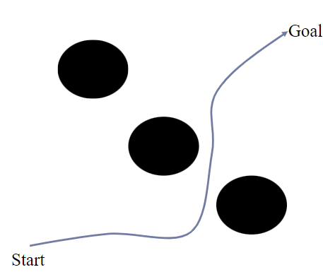
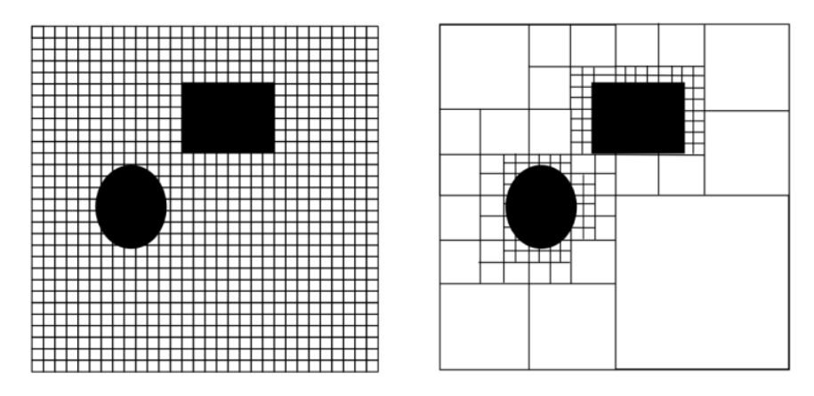
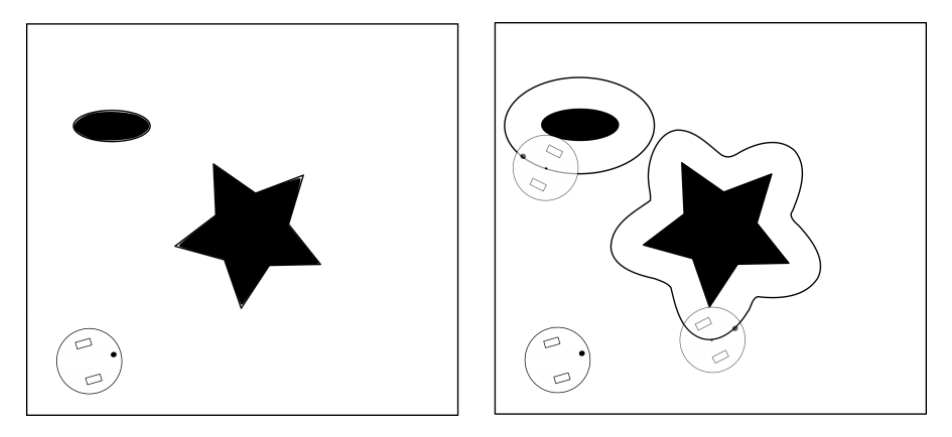
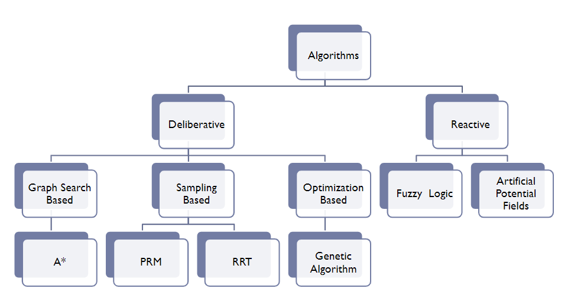

# Introduction to Path Planning

In robotics, path planning refers to how a robot should move around in space to accomplish its goals (often just getting from point A to point B without crashing into anything along the way). 

## Things to consider

* Spatial reasoning/understanding of  robots, as it can have many dimensions in space, obstacles can be complicated.
* Global Planning of the path according to the the given environment.
* Online Local Planning is required to know whether environment is dynamic.
* Besides collision-free, should a path be optimal in time,energy or safety. Computing exact collision free paths is computationally expensive in 3D  problem
* Kinematic, dynamic, and temporal reasoning may also be required

## Space Representation

A mapped representation of their surroundings is either given to or implicitly built into robots. This map can be saved as a discrete approximation with chunks of equal or varying sizes (like a grid map) (like a topological map, for example road-maps).Continuous map approximations can be saved by defining inner and outer boundaries as polygons and paths around boundaries as a sequence of real valued points. Although continuous maps have obvious memory advantages, discrete maps are more commonly used in robotic path planning because they map well to graph representations, which have a long history of search and optimization algorithms with simple computation complexity.

The **occupancy grid** discretizes a space into squares of arbitrary resolution and assigns each square a binary or probabilistic value of full or empty. Grid maps can be optimised for memory by storing them as a k-d tree, with only important boundary information saved at full resolution.

To account for the fact that robots have physical embodiments that require space within the spatial map, **configuration space** is defined in such a way that the robot is reduced to a point-mass and all obstacles are enlarged by half of the robot's longest extension.

## Path Planning algorithms
The problem to find an optimal path has been studied since many decades. There are many algorithms that are `graph-based`, `sampling-based`. Each branch follows a particular approach to solve the path planning problem.

### Deliberative

#### Graph Based Algorithms
Graph-based algorithms search for an optimal path by superimposing a topological graph on a robot's configurational space.

Some of the notable graph-based algorithms are:

- _A-Star (A*)_
- _Dynamic A-Star (D*)_
- _Dijkstra's Algorithm_

**Pros** 

- Resolution Optimal                      
- Resolution Complete

**Cons**

- Time Comlexity
- Discrete States
- Discrete Action Sets
- Holonomicity(Can be controlled with a different modeling. Not implemented in given code.)

#### Sampling Based Algorithms
Algorithms based on sampling represent the configuration space with a roadmap or construct a tree by randomly sampling states in the configuration space.

* **Pros**  
    * **PRM**                                
        - Probalistically Optimal                     
        - Probalistically Complete
        - Reasonable Computation Time
    *  **RRT**
        - Probalistically Complete
        - Near real time performance.

* **Cons**
    * **PRM**                                
        - Narrow corridor problem                   
        - Roadmap generation not for dynamic environments
        - Holonomicity(Can be controlled with a different modeling. Not implemented in given code.)
    *  **RRT**
        - Narrow corridor problem 
        - Not optimal and voronoi bias
        - Practically not complete

Some of the notable sampling-based algorithms are:

- _Rapidly exploring Random Tree (RRT)_
- _RRT Star (RRT*)_
- _Probabilistic Roadmap Method (PRM)_

#### Optimization Based Algorithms
It is a slow gradual process that works by making changes to the making slight and slow changes. Also, makes slight changes to its solutions slowly until getting the best solution.

**Pros**      

- Probabilistically Complete                     
- Probabitistically Optimal

**Cons**

- Narrow corridor problem 
- Computationally Expensive
- Practically not Complete

One of the notable optimization-based algorithms is:

- _Genetic Algorithm_

### Reactive

- **Fuzzy Logic Algorithm**
- **Artificial Potential Fields**

## Resources

- [Github Repository](https://github.com/zhm-real/PathPlanning)
- [Cornell Website](http://correll.cs.colorado.edu/?p=965).
- [Youtube Video](https://www.youtube.com/watch?v=NwwsjVsYTbg).
