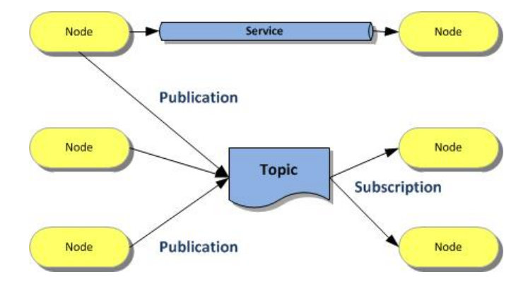
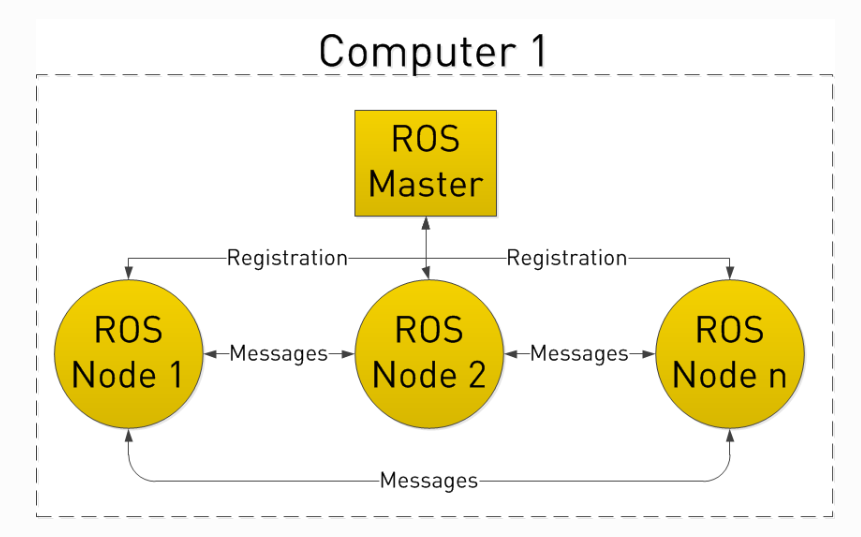
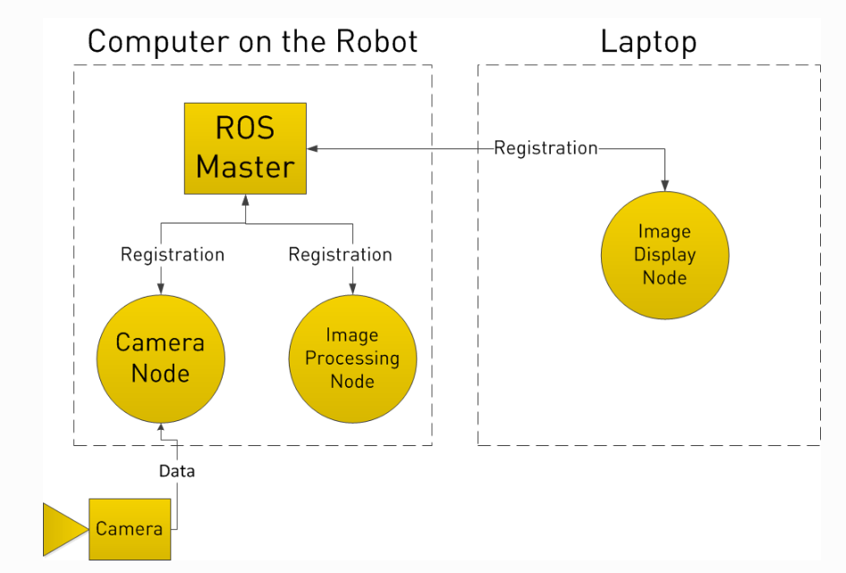
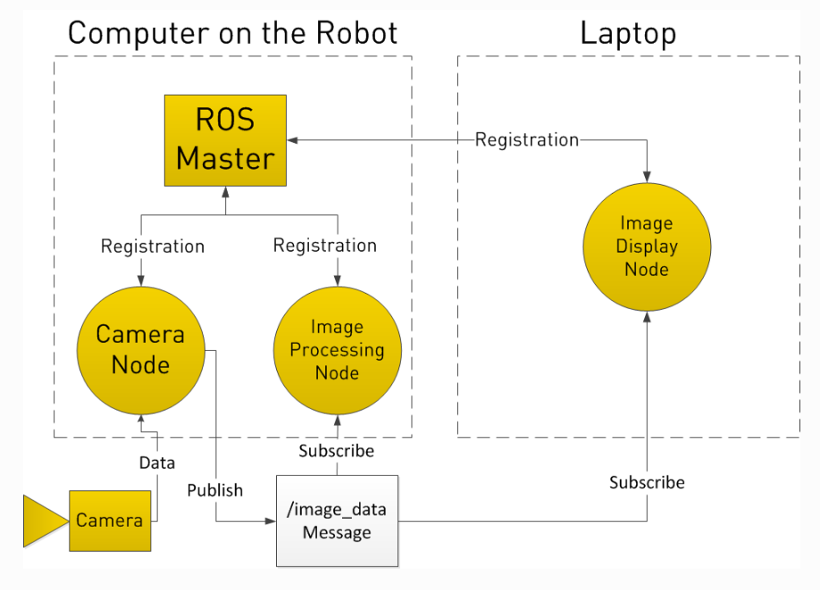
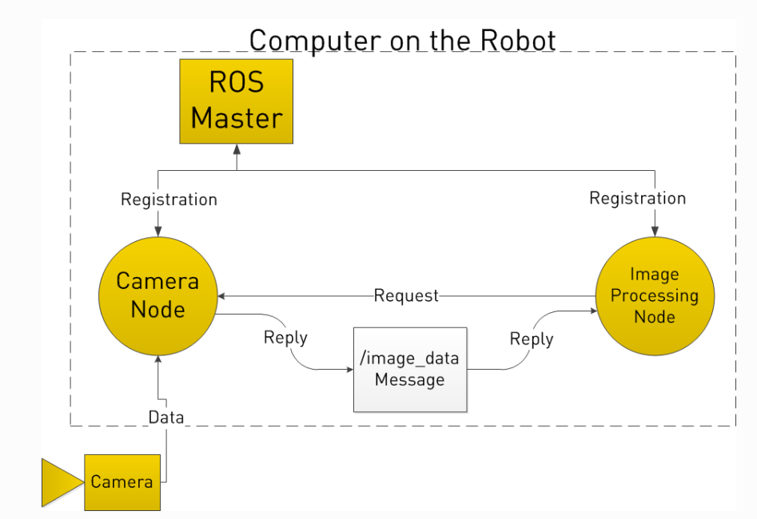

# Getting Started with Robot Operating System

## What is ROS?

ROS (Robot Operating System) is a BSD-licensed system for controlling robotic components from a PC. A ROS system is comprised of a number of independent nodes, each of which communicates with the other nodes using a publish/subscribe messaging model. For example, a particular sensor’s driver might be implemented as a node, which publishes sensor data in a stream of messages. These messages could be consumed by any number of other nodes, including filters, loggers, and also higher-level systems such as guidance, pathfinding, etc.

ROS is best thought of as a collection of tools and frameworks that make automating robotics projects much easier for someone who is absolutely new to it. Every ROS project has a specific structure that must be followed. It would be your responsibility to fill in the automation code and define how the various components of your code communicate with one another. After that, the underlying ROS framework handles the networking and connectivity.

*Resources* : ​[Youtube Tutorials](https://www.youtube.com/watch?v=J1qT85pTW0w&feature=youtu.be)

A ROS system can be visualized as a graph where all the vertices are ​nodes and the edges between them are known as ​topics. In simple terms nodes are programs that perform a particular task and send out/receive data in the form of messages. These messages are exchanged between two nodes over the topic (edge) connecting them.

## Why ROS?

Note that nodes in ROS do not have to be on the same system (multiple computers) or even of the same architecture! You could have a Arduino publishing messages, a laptop subscribing to them, and an Android phone driving motors. This makes ROS really flexible and adaptable to the needs of the user. ROS is also open source, maintained by many people.

## Basic Terminologies and Commands

**Nodes:** A ​node is an executable file (could be python or C++) which performs a specific task and communicates with other nodes through ​ topics.
<center></center>

**Topics:** Topics and are ways of communication between nodes. They depend from each node (see node definitions). Services rely on a query made by a given node or from terminal, getting a response from the node
offering the service. 
ROS messages have to be specially defined for each user defined topic. Apart from the standard message types that come with ROS like ​string, int32, etc. you can also define your custom message types in ROS for custom uses. 

*Resources* : Go through [ROS wiki on Topics](http://wiki.ros.org/Topics)​ to know more.

- Note: A single node can simultaneously act as a subscriber to one topic and a publisher of another topic and a server for one service and the client for another.

**Packages:** ​ Packages are used to organise all of ROS's coding and software. ROS Nodes, libraries utilised in those codes, message and service definitions, as well as any dependencies, may all be contained in a package. Two files, CMakeLists.txt and package.xml, will be used throughout our workplan once we create the package. There is a separate directory *src*  from these files. The code for the package's ROS nodes is stored here (as mentioned before, nodes are nothing but programmes that perform specific tasks). It must be built after the ROS package is created before it can be used.

*Resources* : 

- Go through catkins method of creating [ROS Packages](http://wiki.ros.org/ROS/Tutorials/CreatingPackage)
- Go through [ROS wiki Package Building Tutorial](http://wiki.ros.org/ROS/Tutorials/BuildingPackages)

​
**Catkin:** Catkin is the build system used for ROS.catkin is the ROS build system: the set of tools that ROS uses to generate executable programs, libraries, scripts, and interfaces that other code can use. If you use C++ to write your ROS code, you need to know a fair bit about catkin. To build packages you must have a catkin workspace where all your projects are contained. You will have to use it to ​ build ​ not only yours but any other packages that may be in your workspace. A catkin workspace or package can be built running either of these two commands : ```catkin_make``` or ```catkin build``` in the root of your catkin workspace.

*Resources* : 

- [Catkin wiki page](http://wiki.ros.org/catkin/conceptual_overview)​ and [Catkin conceptual overview](http://wiki.ros.org/catkin/conceptual_overview?distro=indigo) to learn more about catkin. 


- Note: The command used to build a workspace should be consistent every time; for example, if the workspace was built using ```catkin make``` the first time while initialising it, all subsequent builds should use ```catkin make```. To change the build process in an existing workspace, run the command ```catkin clean```, which will remove everything but the workspace's source space (src folder). The desired command can then be used to rebuild it.

**Workspace:** ​A ROS workspace is just a hierarchical directory where all of your linked ROS codes are stored. A workspace has packages, which contain, among other things, the code for nodes. On your computer, you can have numerous workspaces, but you can only work in one at a time.

*Resources* : 

- [Catkin Workspace Tutorial](http://wiki.ros.org/catkin/Tutorials/create_a_workspace)​  

**Colcon:** Colcon is another build system just like catkin. It comes with a vast array of features which can be used to organise your workspace. Similar to catkin, to build a workspace, you need to run ```colcon build``` in the root of the folder your workspace. 

*Resources* : 

- Go through [Colcon documentation](https://colcon.readthedocs.io/en/released/user/quick-start.html) for complete overview.

**Publisher-Subscriber Model**

Two nodes can exchange data in the form of messages asynchronously, usually used when a one way stream of information is   involved.The object of a ROS node which publishes the data in the form of messages over a topic is called **Publisher**. The rate of publishing of messages can be defined by user. The data published by the publisher of one ROS node can be received through the object of a ROS node called **Subscriber**.

*Resources* : 

- [Writing Publishers-Subcribers in C++​](http://wiki.ros.org/ROS/Tutorials/WritingPublisherSubscriber%28c%2B%2B%29#roscpp_tutorials.2FTutorials.2FWritingPublisherSubscriber.Writing_the_Publisher_Node)
- ​[Writing Publishers-Subcribers in Pytho​n](http://wiki.ros.org/ROS/Tutorials/WritingPublisherSubscriber%28c%2B%2B%29#roscpp_tutorials.2FTutorials.2FWritingPublisherSubscriber.Writing_the_Publisher_Node) 

**Client-Server Model**  

Another common mode of communication, especially suited when there is a transaction style relationship between the two nodes is the service - consisting of a *server* and a *client*. The node which sends requests to a server is called **Client**. A special function that acts as a proxy between the client and server can be created. When called, the function sends a request to the server with the arguments passed to it as parameters. The node which constantly monitors for requests from the client is called **Server**.It does the required task independently of the client and returns the response when the task is completed.

*Resources* :

- [Writing Client-Service in C++​](http://wiki.ros.org/ROS/Tutorials/WritingServiceClient%28c%2B%2B%29)
- [​Writing Client-Service in Python](http://wiki.ros.org/ROS/Tutorials/WritingServiceClient%28python%29)​ 

**ROS Master:** It is a central server to which all nodes are connected by default. It allows any node to look up information about any other node, essentially it is needed for connecting nodes within the system. A node gets the network address of another  node from ROS Master.

**rosrun:** On starting the ROS Master one can now start their own ROS nodes. For this ROS has a special command called  rosrun which lets you run the executable files for their own node from anywhere by running following command (replace <package_name> and <executable_name> appropriately) : -

```bash
rosrun <package_name> <executable_name>.py
```
**Note** : 

- If using python, before attempting to run any ROS nodes that you have written, make sure that you have given executable permission to the code files. For more info on linux file permission look ​[here​](https://www.guru99.com/file-permissions.html) by running the following command (replace <executable_name> appropriately) : -

```bash
chmod u+x <executable_name>.py
```

- When one runs ```roscore``` or their own ROS node, the terminal is held until it is terminated. As a result, if you are running many nodes, each one must be run in a different terminal window. In such scenario ​[terminator](https://terminator-gtk3.readthedocs.io/) comes handy.
 ​

**roslaunch:** There can be a lot of nodes in a ROS project, and launching them one by one can be a pain. roslaunch is a command that uses launch-files to launch a certain set of nodes all at once in a single terminal. These files usually contain a list of nodes and other related info and are generally stored in the ```launch``` directory inside a package.

*Resources* :

- [ROS Launch tutorial](http://wiki.ros.org/roslaunch/Tutorials)

**roscd:** ```roscd``` is a command line tool which allows you to navigate or ```cd``` (change directory) to (in command line terms) a package without knowing its exact path. Note: The workspace in which the package is present needs to be sourced. E.g. If you wish to navigate into the ```turtlebot3_gazebo``` package you’ll just type the following command in the terminal:

```bash
roscd turtlebot3_gazebo
```

**rqt_graph:** Once you have your system running, you can obtain a diagram along with other details of the system by running the  ```rqt_graph``` command in another terminal window.

## General Understandings

ROS starts with the ROS Master. The Master allows all other ROS pieces of software (Nodes) to find and talk to each other. That way, we do not have to ever specifically state “Send this sensor data to that computer at 127.0.0.1. We can simply tell Node 1 to send messages to Node 2.

<center></center>

Nodes do this by publishing and subscribing to **Topics**.


Let’s say we have a camera on our Robot. We want to be able to see the images from the camera, both on the Robot itself, and on another laptop.

**In our example,** we have a Camera Node that takes care of communication with the camera, a Image Processing Node on the robot that process image data, and a Image Display Node that displays images on a screen. To start with, all Nodes have registered with the Master. Think of the Master as a lookup table where all the nodes go to find where exactly to send messages.

<center></center>

In registering with the ROS Master, the Camera Node states that it will Publish a Topic called /image_data (for example). Both of the other Nodes register that they areSubscribed to the Topic /image_data.

Thus, once the Camera Node receives some data from the Camera, it sends the /image_data message directly to the other two nodes. (Through what is essentially TCP/IP)

<center></center>

Now you may be thinking, what if I want the Image Processing Node to request data from the Camera Node at a specific time? To do this, ROS implements Services.

A Node can register a specific service with the ROS Master, just as it registers its messages. In the below example, the Image Processing Node first requests /image_data, the Camera Node gathers data from the Camera, and then sends the reply.

<center></center>


## ROS Parameters and Parameter Server

A parameter server is a collection of values or parameters that nodes can retrieve or modify during runtime in response to requests made via command prompt, nodes, or launch files. Parameters are static, globally accessible values such as integers, floats, texts, and boolean values that can be saved separately or within a YAML file. Nodes may readily check the configuration status of the system and make changes if necessary because parameters are supposed to be gloablly accessible.

### Accessing and setting Parameters

#### Via command line 
Parameters can be accessed, modified or deleted using the `rosparam` command line utility in the `rosbash` suite of terminal commands.

1. To list all the parameters : 

```bash
rosparam list
```
    
   Or to list all the parameters in a specific [namespace](https://www.theconstructsim.com/ros-5-mins-046-ros-namespace/) :

```bash
rosparam list </namespace>
```
        
2. To assign a value to an already existing parameter or to set a new one :

```bash
rosparam set <parameter_name> <parameter_value>
```
    
Note : You can also load the parameters into the parameter server from a YAML file using 

```bash
rosparam load <filename> <namepsace>
```
    
3. To get/read a parameter value :

```bash
rosparam get <parameter_name>
```
    
Note : You can also dump/save the parameters into a YAML file from parameter server using

```bash
rosparam dump <filename> <namespace>
```
    
For more insights regarding the `rosparam` tool refer to [ROS wiki](http://wiki.ros.org/rosparam).   
    
#### Via the rospy API library 

Parameters from the parameter server can be accessed and modified using `rospy` API library. This is generally used when the parameters are to be used by a node during the runtime.

For more imformation on handling parameters using `rospy` API library go through [rospy overview](http://wiki.ros.org/rospy/Overview/Parameter%20Server) 

#### Via launch files

Parameters can be set, created and loaded into the parameter server while creating launch files.   For more information on handling parameters in launch files go through [roslaunch wiki](http://wiki.ros.org/roslaunch/XML/param).

For more information go through [ROS wiki on Parameter Server](http://wiki.ros.org/Parameter%20Server)

## Learning Materials

- [A Gentle Introduction to ROS](https://drive.google.com/file/d/16KVq4xRZGvG5yVtNwFp7_M9a-eWYHJ0S/view?usp=sharing) by Jason M.'O Kane​ (use IIT BBS email-id to access link)
- [Programming Robots with ROS](https://drive.google.com/file/d/1mWJNd8R7qR059PwPU214JoTYToakFzZJ/view?usp=sharing) by Morgon Quigley (use IIT BBS email-id to access link)
- [Official ROS Tutorials](http://wiki.ros.org/ROS/Tutorials).


