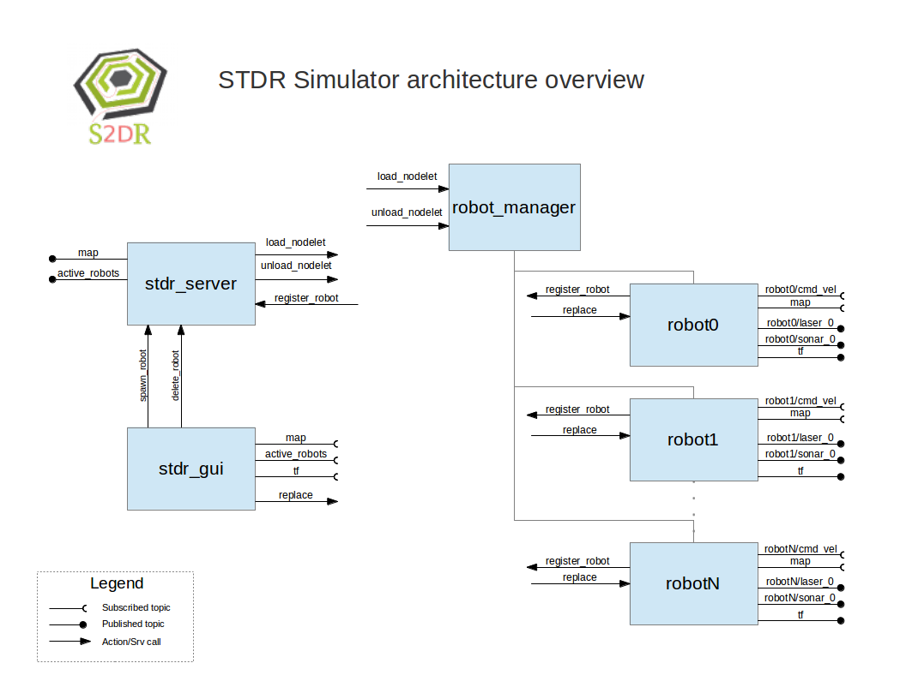

### General Introduction

STDR is a simple two dimensional robot simulator. It is very useful in cases where there is no need for computationally costly 3-D simulation of robots. It is computationally light and serves the purpose good. Hence it is very useful for learning based robotics or for multi robot simulation.

### Installation

1. For ROS Kinetic, stdr can be installed using apt-get.
2. For ROS Melodic, it is advisible to install stdr from [source](https://github.com/stdr-simulator-ros-pkg/stdr_simulator).

### Architecture Overview

<center>{: style="height:500px"}</center>

(Reference: [ROS Wiki](http://wiki.ros.org/stdr_simulator))

### Basic Usage

- The ```stdr_launchers``` package contains launch files basic usage. However, custom launch files can be created to serve personal purposes easily. Some of the launch files are
	1. ```server_no_map.launch``` launches the stdr server without any map, robot or the gui.
	2. ```server_with_map_and_gui.launch``` launches the serve with preloaded map and gui.
	3. ```server_with_map_and_gui_plus_robot.launch``` launches the stdr_server, with preloaded map and robot along with the gui
- You can also launch Rviz with a preset config file using ```rviz.launch``` file in the stdr_launchers package.

### Robot Namespaces

1. The topics corresponding to each robot have a unique namespace attached to it. For example the first robot launched has a namespace ```/robot0```. Published topics pertaining to that robot are published as ```/robot0/topic_name```.
2. Note that whenever a new robot is spawned the robot number is incremented by 1. This happens even though you delete a robot.
3. such namespacing avoids conflicts of topic names when doing multi robot simulation.

### References

1. For more information refer the ```stdr_simulator``` page  in [ROS Wiki](http://wiki.ros.org/stdr_simulator).
2. The github [repository](https://github.com/stdr-simulator-ros-pkg/stdr_simulator) for stdr_simulator.
