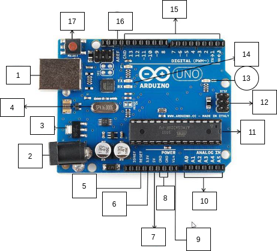
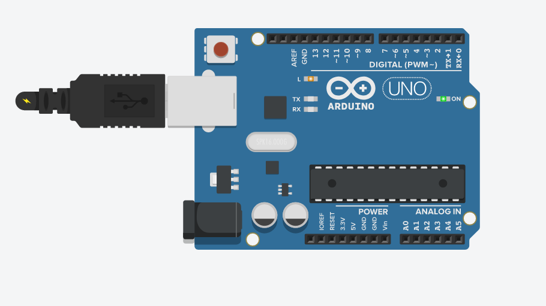
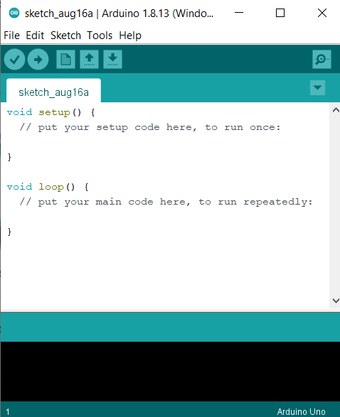
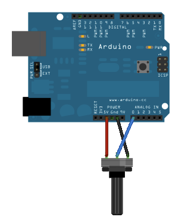

# Arduino

The Arduino is basically a very accessible and easy to program microcontroller. Unlike other microcontrollers, which need knowledge of registers and ports, the Arduino is programmed by a very basic C-derived language. [This](https://www.youtube.com/watch?v=CqrQmQqpHXc) [video](https://www.youtube.com/watch?v=CqrQmQqpHXc) explains what an Arduino is, what it is capable of, and the numerous projects one can use it for.

## Arduino Board Layout

<center></center>

The above diagram shows an Arduino UNO board with all the parts labelled and explained below:

1.  **USB Port:** Arduino can be powered by connecting it to your computer using a USB cable. It is also used for uploading code and communicating via the serial port.
2.  **Power Jack:** Used to power an arduino directly from a wall adaptor.
3.  **Voltage Regulator:** Controls and stabilises the voltage used by the Arduino and its components.
4.  **Crystal Oscillator:** A microcontroller is a clock based device. The crystal oscillator present on the arduino generates a clock of frequency 16MHz.
5.  **Reset controllers:** Resetting the arduino board starts the execution of a program from the beginning. Arduino can be reset in 2 ways : by pressing the reset button (17) and sending a 0V signal to the RESET pin (5).
6.  **3.3V power**
7.  **5V power**
8.  **GND (0V)**
9.  **VIN:** This pin can be used to power the arduino board from an external power source, from 7-20V.
10.  **Analog Pins:** These pins (labeled A0-A5) can be used to read continuous analog values (between 0 and 5V). They are often used to interface the Arduino with analog sensors.
11.  **Main Microcontroller:** This IC is the main microcontroller, that executes the code you program it with.
12.  **ICSP Pin:** Can be used to program the arduino board’s firmware. For advanced users only.
13.  **Power LED indicator:** Indicates whether the board is powered up correctly.
14.  **TX/RX LEDs:** The TX/RX pins flash to indicate transfer/receival of serial data between the computer and Arduino.
15.  **Digital I/O Pins:  **These pins can be programmed as input/output pins. When used as output, they can be set HIGH (+5V) or LOW (0V).
16.  **Analog Reference(AREF):** Can be used to set an external reference voltage(0-5V) as the upper limit for analog input pins.
17.  **Reset Button:** Pressing it causes the Arduino to restart its code.

## The Blink Sketch

The Blink sketch is like the “Hello World” program in the Arduino world. It simply consists of blinking the onboard LED (labeled ‘L’). No actual circuit connections are required!

<center></center>

### Code

You can copy the code from [here](https://github.com/schacon/blink/blob/master/blink.ino).

## How to code an Arduino in Arduino IDE

1.  Download and install Arduino Software (IDE) from [here](https://www.arduino.cc/en/main/software). The Integrated Development Environment (IDE) is a common coding environment for all arduino boards.
2.  Open the IDE and a new sketch will open up which would look like the image below. Sketch is just a name arduino uses for a program.
3.  Then just paste the entire code here.
4.  Now connect your Arduino UNO board to your PC using an A B USB cable and select the option "Arduino/Genuino Uno" under **Tools > Board** menu. Also make sure to select the correct port through which the PC is connected to the board under **Tools > Port** menu.
5.  Click on the "tick" button in upper left corner to compile the code and check for errors. After resolving any and all errors click on the "arrow" button next to it to upload the code to the board.
6.  After successful upload the Arduino Uno will start executing the code while drawing power from the PC through the USB cable.

<center></center>

### Explanation

Every Arduino sketch **must** have two particular functions:

1.  void setup()
    1.  The setup() function is called when a sketch starts and will only run once, after each powerup or reset of the Arduino board.
2.  void loop()
    1.  This function does precisely what its name suggests, that is loops consecutively, allowing your program to change and respond. Whatever code you write inside loop() will keep running as long as the Arduino is receiving power.

Let us examine the [Blink](https://github.com/schacon/blink/blob/master/blink.ino) sketch now, line by line.

```cpp
int led = 13;
```

This line assigns a name to the pin that the LED is attached to, i.e. pin 13.

Then we have the setup() function, which runs only once. It includes the following line.

```cpp
pinMode(led, OUTPUT);
```

This tells the Arduino to configure that pin as an output.

Then we have the following loop() function.

```cpp
void loop()
{
  digitalWrite(led, HIGH);  // turn the LED on (HIGH is the voltage level)
  delay(1000);               // wait for a second
  digitalWrite(led, LOW);    // turn the LED off by making the voltage LOW
  delay(1000);              // wait for a second
}
```

The digitalWrite() function tells a pin to either switch on (HIGH, or +5V) or off (LOW, or 0V).  The delay() function tells the Arduino to wait for a specified number of milliseconds.

## Reading Analog Values

The following circuit reads the voltage from a potentiometer and sends it via USB to the serial port.

### Schematic

<center></center>

### Code

Copy the code from [here](https://create.arduino.cc/example/builtin/01.Basics%5CAnalogReadSerial/AnalogReadSerial/preview) and paste it into a new sketch in the Arduino IDE and upload the code to the board. After successful uploading open the serial monitor in the IDE by clicking on its button on top right corner. Trying varying the potentiometer’s knob - you should see the stream of values of the serial monitor change.

### Explanation

Whenever the serial port is to be used, it should be initialised with the following line _inside_ void setup(). The 9600 refers to the communication speed in bits-per-second.

```cpp
Serial.begin(9600);
```

The analogRead function reads the voltage at an analog pin and linearly converts it to a value between 0 and 1023. The Serial.println() function prints a variable to the serial monitor, followed by a newline (using Serial.print() to print data without the newline). The delay(1) is to limit the amount of data printed to the serial monitor.

## References


2. For some more detailed tutorials do read the documentation of [Arduino](https://www.arduino.cc/en/Tutorial/HomePage).
3. For some video tutorials check out Jeremy Blum's [playlist](https://www.youtube.com/playlist?list=PLA567CE235D39FA84) for Arduino.
4. For more DIY project ideas and inspirations check out [Great Scott's](https://www.youtube.com/c/greatscottlab/featured) youtube channel.
5. To read more about the projects made by people using Arduino, check out Arduino's [blog](https://blog.arduino.cc/) as well.