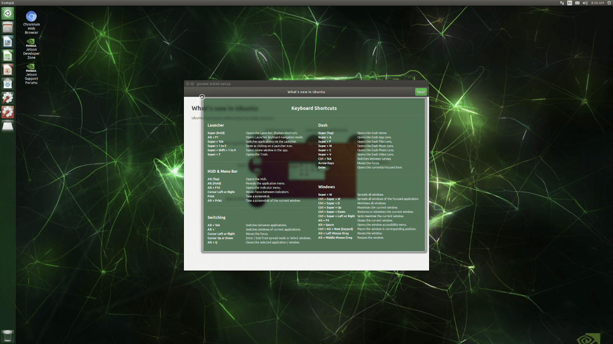

<center>{: style="height:200px"}</center>

# Getting Started with NVIDIA Jetson Nano

The NVIDIA Jetson Nano Developer Kit is a small edge computer for AI development. The Jetson Nano Developer Kit packs a Quad-core ARM A57 CPU with a clock-rate of 1.43GHz and 4GB of low-power DDR4 Memory.

The NVIDIA Jetson Nano Developer Kit is a small edge computer for AI development.


The Jetson Nano Developer Kit packs a Quad-core ARM A57 CPU with a clock rate of 1.43GHz and 4GB of low-power DDR4 memory. For the connectors, it has 4x USB 3.0, 1xUSB2.0 Micro-B for powering with 5V, an HDMI and Display Port connector for connecting displays, as well as one or two camera connectors that allow you to connect a Raspberry Pi Camera.
<center></center>

|**Parameter**|**Meaning**|
|---------|-------|
|GPU	|128-core Maxwell|
|CPU	|Quad-core ARM A57 @ 1.43 GHz|
|MEMORY	|4 GB 64-bit LPDDR4 25.6 GB/s|
|STORAGE	|microSD (not included)|
|VIDEO ENCODER	|4K @ 30 , 4x 1080p @ 30 , 9x 720p @ 30 (H.264/H.265)|
|VIDEO DECODER	|4K @ 60 , 2x 4K @ 30 , 8x 1080p @ 30 , 18x 720p @ 30 (H.264/H.265)|
|CAMERA	|2x MIPI CSI-2 DPHY lanes|
|CONNECTIVITY	|Gigabit Ethernet, M.2 Key E|
|DISPLAY	|HDMI and display port|
|USB	|4x USB 3.0, USB 2.0 Micro-B|
|OTHERS	|GPIO, I2C, I2S, SPI, UART|
|MECHANICAL	|69 mm x 45 mm, 260-pin edge connector|

### Requirements
Besides the Jetson Nano Developer Kit, you'll also need a microSD card, a power supply (5V 2A), and an ethernet cable or WiFi adapter.

### microSD card

The Jetson Nano uses a microSD card as a boot device and primary storage. The minimum size for the microSD card is 16GB, but I would strongly recommend getting at least 32GB. It's also essential to get a fast microSD as this will make working on the Jetson Nano a lot more fluent.

### Power Supply

The Jetson Nano can be powered in three different ways: over USB Micro-B, Barrel Jack connector, or through the GPIO Header.

To power the Jetson Nano over USB Micro-B, the power supply needs to supply 5V 2A. Unfortunately, not every power supply is capable of providing this. NVIDIA specifically recommends a 5V 2.5A power supply from Adafruit, but I use a Raspberry Pi power supply, and it works just fine.

If you want to get the full performance out of the Jetson Nano, I'd recommend using the Barrel Jack instead of powering over USB because you can supply 5V 4A over the Barrel Jack.

Before connecting the Barrel Jack, you need to place a jumper on J48. The power jumper location can vary depending on if you have the older A02 model or, the newer B01 model.

### Ethernet cable or WiFi Adapter

Lastly, you'll need an ethernet cable or a WiFi Adapter since the Jetson Nano doesn't come with one. For the WiFi Adapter, you can either use one that connects through USB or a PCIe WiFi Card like the Intel® Dual Band Wireless-AC 8265.

### Setup

Before we can get started setting up a Python environment and running some deep learning demos, we have to download the Jetson Nano Developer Kit SD Card Image and flash it to the microSD card.

After inserting the microSD card, you can connect the power supply, which will automatically boot up the system.

When you boot the system for the first time, you'll be taken through some initial setup, including:

Review and accept NVIDIA Jetson software EULA
Select system language, keyboard layout, and time zone
Create username, password, and computer name
Log in
After the initial setup, you should see the following screen:
<center></center>

### Increasing swap memory

Recent releases of JetPack enable swap memory as part of the default distribution using the zram module. By default, 2GB of swap memory is enabled. To change the amount of swap memory, you can either edit the /etc/systemd/nvzramconfig.sh file directly or use the resizeSwapMemory repository from JetsonNanoHacks.

```
git clone https://github.com/JetsonHacksNano/resizeSwapMemory
cd resizeSwapMemory
 ./setSwapMemorySize.sh -g 4
```

After executing the above command, you'll have to restart the Jetson Nano for the changes to take effect.

### Installing prerequisites and configuring your Python environment

Now that the Jetson Nano is ready to go, we will create a deep learning environment. We will start by installing all prerequisites and configuring a Python environment, and how to code remote using VSCode Remote SSH.

### Installing prerequisites

```
sudo apt-get update
sudo apt-get upgrade

sudo apt-get install git cmake python3-dev nano

sudo apt-get install libhdf5-serial-dev hdf5-tools libhdf5-dev zlib1g-dev zip libjpeg8-dev
```
### Configuring your Python environment

Next, we will configure our Python environment. This includes downloading pip3 and virtualenv.

### Install pip

```
sudo apt-get install python3-pip
sudo pip3 install -U pip testresources setuptools
```
For managing virtual environments, we'll be using virtualenv, which can be installed as below:

```
sudo pip install virtualenv virtualenvwrapper
```
To get virtualenv to work, we need to add the following lines to the ` ~/.bashrc` file:

```
# virtualenv and virtualenvwrapper
export WORKON_HOME=$HOME/.virtualenvs
export VIRTUALENVWRAPPER_PYTHON=/usr/bin/python3
source /usr/local/bin/virtualenvwrapper.sh
```
To activate the changes, the following command must be executed:
```
source ~/.bashrc
```
Now we can create a virtual environment using the `mkvirtualenv` command.

```
mkvirtualenv ml -p python3
workon ml
```
