<center>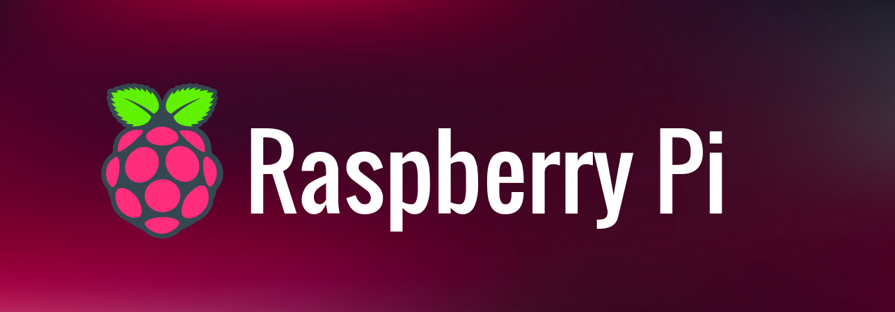</center>

# Getting Started with Raspberry Pi

#### Things You will Need

* Raspberry Pi 4 B [In this guide]
* A 15W USB-C power supply – we recommend the official Raspberry Pi USB-C Power Supply
* Micro SD card reader for flashing Raspian OS.
* Micro SD card Raspberry Pi OS, installed using the Raspberry Pi Imager
* A keyboard , display and mouse
* HDMI to micro HDMI Cable to connect to  display via Raspberry Pi 4's micro HDMI ports
* An ethernet cable (optional)

#### Pinouts

<center>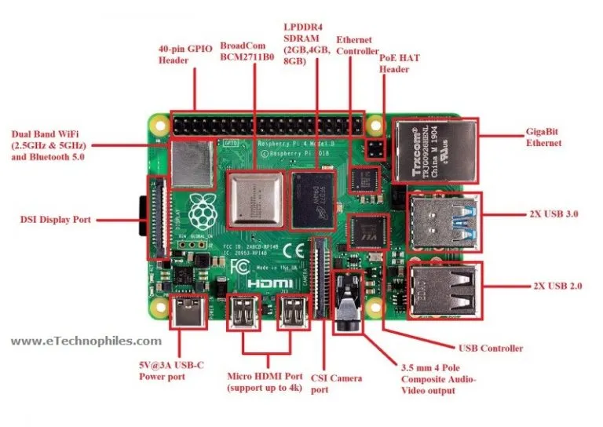</center>
<center>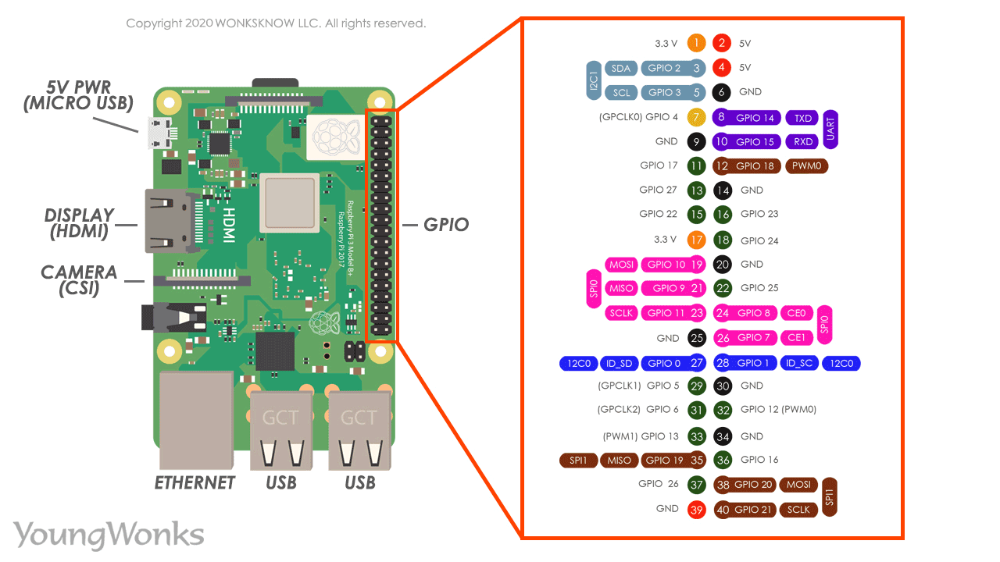</center>

#### Powering Up Raspberry Pi

The Raspberry Pi 4 B requires a charger that can output 5 volts and 3 amps. Most USB Type-C phone chargers don't have enough amps to get the job done, unless they have USB PD capability, but USB-C laptop chargers should all work. While it's unlikely to be a problem, note that Pi 4 models that were manufactured in 2019 or early 2020 have a bug which prevents them from charging over high-speed data cables that support USB 3.x 5 or 10 Gbps connections. 

<center>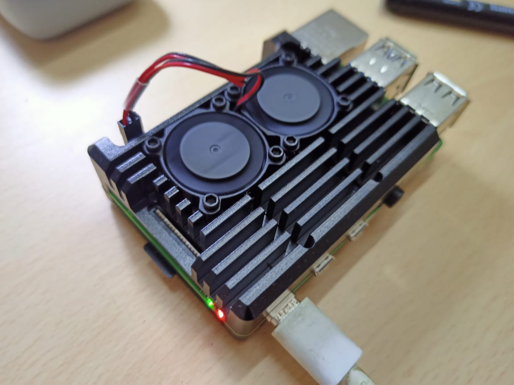</center>

**Note :** The Pi doesn't have a built-in power switch, so the default way to turn it on is to plug it in. However, to avoid data loss, you'll want to use the shutdown feature in your operating system (OS) before unplugging or switching it off.

### Headless Install for Raspberry Pi

If you just want to experiment with the Pi or use it to control physical objects like lights, motors and sensors, you don't need to give it its own screen and keyboard then you have to do following steps.

**Step 1: Installing Raspberry Pi OS on Your microSD card**

1. Insert a microSD card into your computer your card should be 8GB or larger(preferrably 32GB).
    <center>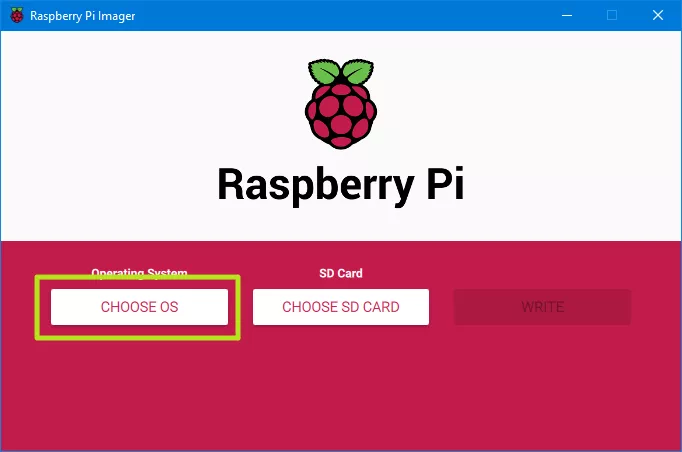</center>

2. Download, install and run Raspberry Pi Imager. 
    <center>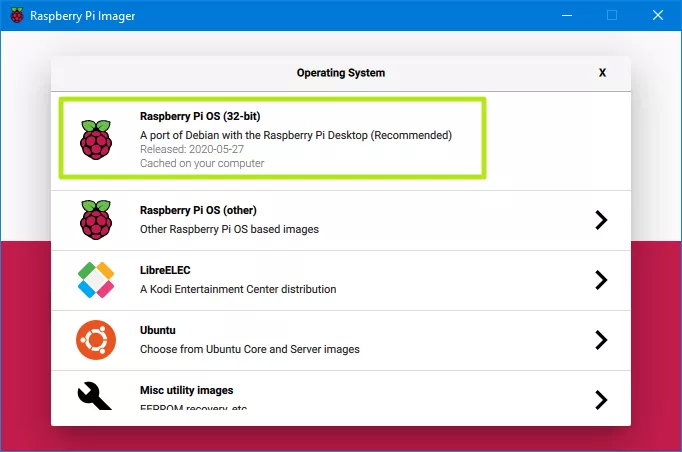</center>

3. Click the Choose OS button, a menu will appears.
    <center>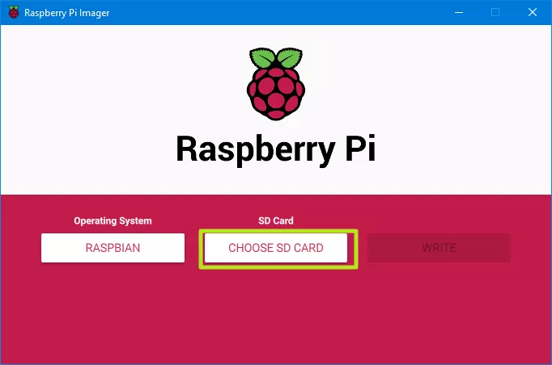</center>

4. Select Raspberry Pi OS (32-bit) from the OS menu.


5. Click Choose SD card and select your card from the menu.

    <center>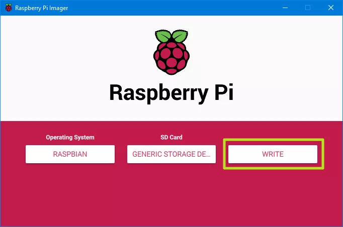</center>

6. Click Write. This process will take several minutes as Raspberry Pi Imager downloads Raspberry Pi OS and burns it to your microSD card.
    **Note:- If you were not setting up a headless Raspberry Pi, you can just pop the card in, connect your Pi to a monitor, keyboard, power source and pointing device and boot it up. However, that's not our goal here.**

    <center>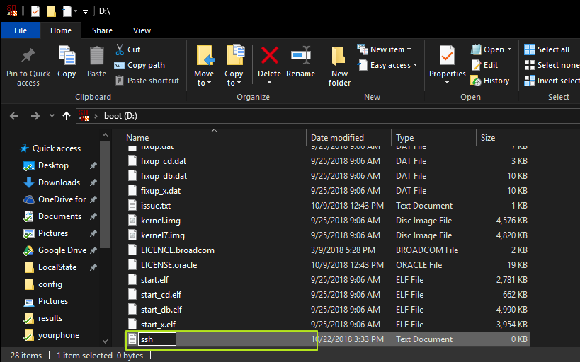</center>

7. Write an empty text file named "ssh" (no file extension) to the root of the directory of the card. When it sees the "ssh" on its first boot-up, Raspberry Pi OS will automatically enable SSH (Secure Socket Shell), which will allow you to remotely access the Pi command line from your PC.

8. Configure a network connection for your Raspberry Pi.Though you've enabled SSH, which will let you log in and issue terminal commands, you still need a way to actually reach your Pi. You can connect via Wi-Fi / Ethernet, direct Ethernet connection or direct USB connection (Pi Zero only). Here are instructions for each.

**Step 2: Headless Wi-Fi / Ethernet**

To setup a Wi-Fi connection on your headless Raspberry Pi, create a text file called wpa_supplicant.conf, and place it in the root directory of the microSD card. You will need the following text in the file.

<center>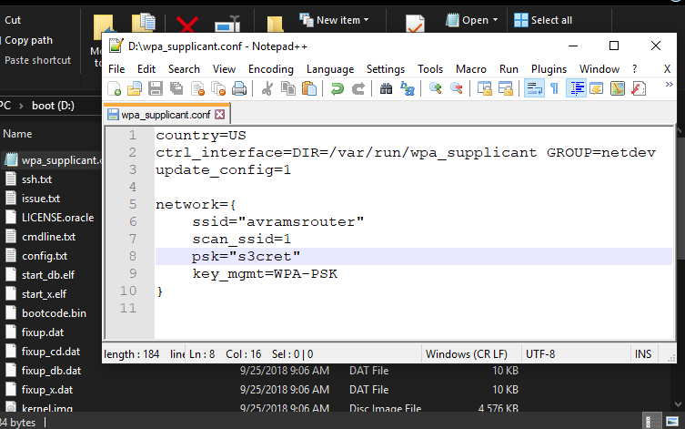</center>

```
    country=US
    ctrl_interface=DIR=/var/run/wpa_supplicant GROUP=netdev
    update_config=1

    network={
    scan_ssid=1
    ssid="your_wifi_ssid"
    psk="your_wifi_password"
}
```

Change the country to "GB" for the UK or to another country code for a different country, and enter your actual SSID and password. Upon boot up, Raspberry Pi OS will log you into that network. However, if you're on a public Wi-Fi network that requires you to click "Ok" on a splash page before you get Internet, this method won't work.

Prefer to use Ethernet? If you plug your Raspberry Pi directly to a wired network, you should be able to access it by its name (raspberrypi or raspberrypi.local) without changing any other files.

**Step 3: Direct USB Connection (Pi Zero / Zero W Only)**

My favorite way to connect is via a direct USB connection, plugging my Pi Zero W directly into a port on my PC. This method is great, because it works no matter where you are (even if there's no available Wi-Fi), and it provides both power and a connection to your Pi, over a single cable. However, you can only do this on a Pi Zero or Zero W.

<center>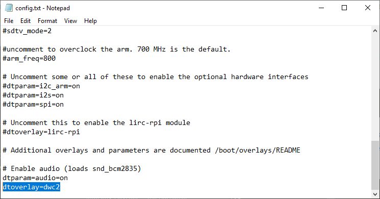</center>

1. Open the file config.txt in the root directory of the micro SD card, and add the line dtoverlay=dwc2 to the very bottom of the file and save.

<center>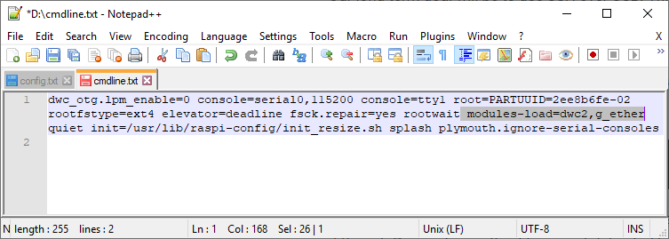</center>

2. Open cmdline.txt and add the text modules-load=dwc2,g_ether after the word rootwait, and save the file. There are no linebreaks in this file.

<center>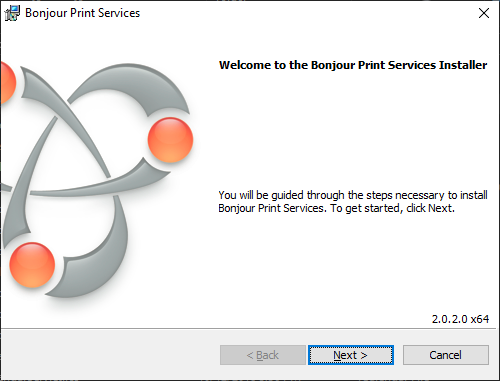</center>

3. Download and install Bonjour Print Services(opens in new tab) from apple.com (if you have Windows). It seems strange that you would need an Apple program to access a Pi from Windows, but this helps your PC see the Pi. Ignore the name; you're not using this for printing.

<center>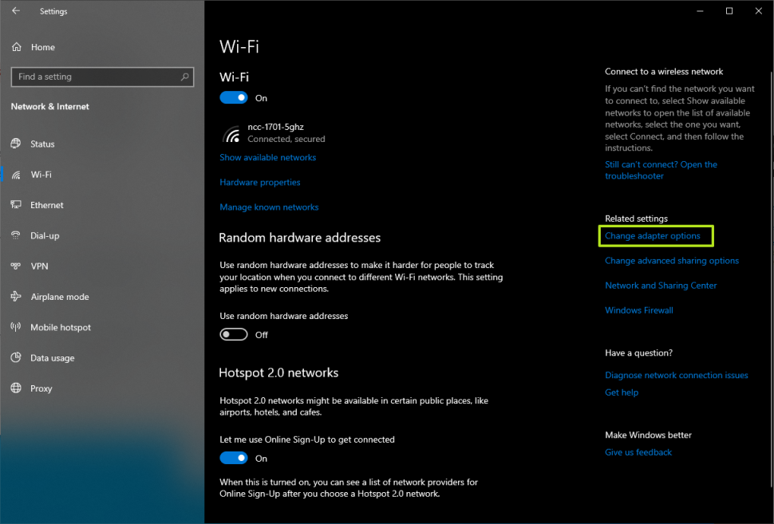</center>

4. Connect the micro USB cable to the port labeled "USB" on the Pi Zero. This will not work if you connect to the port labeled "PWR." However, the "USB" port will also supply power to your Pi, so you don't need to connect a dedicated power wire.

**Step 4: Direct Ethernet Connection**

If your PC has a spare Ethernet port or you have an Ethernet-to-USB dongle, you can use a network cable to go directly from your Pi to your computer. Just make sure that you have Bonjour installed on your PC and SSH enabled on the Pi (see above). Then, you can just connect the two devices over Ethernet.

If you want the Raspberry Pi to get its Internet connection from your PC over the Ethernet port, you need to do the following in Windows 10:

1. Navigate to the Network Connections menu, which is part of the old-school Control Panel. You can get to this screen by going to Settings->Network & Internet->Wi-Fi and then clicking "Change Adapter Settings" on the right side of the screen. This works whether you are sharing an Internet connection that comes to your PC from Wi-Fi or from Ethernet.
<center>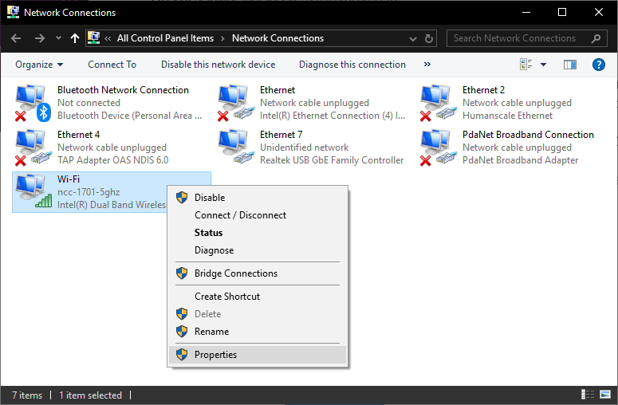</center>

2. Right-click on the adapter that's connected to the Internet, and select properties.
<center>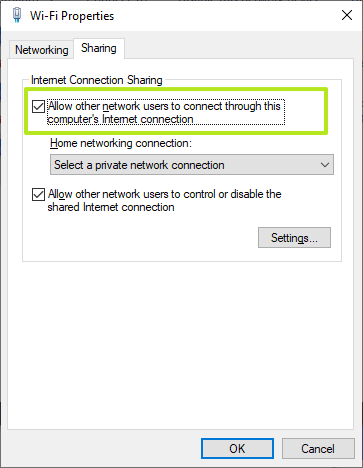</center>

3. Enable "Allow other network users to connect" on the "Sharing" tab.
<center>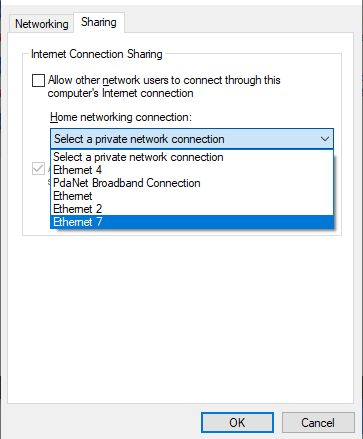</center>

4. Select the Ethernet port that is connected to the Raspberry Pi from the "Home networking connection" menu, and click Ok.
<center>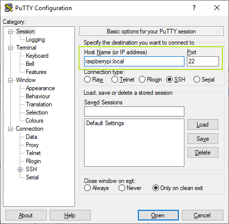</center>


**Step 5: Connecting via SSH**

After you have the Pi connected to your network or directly to your PC, you'll need to establish an SSH connection.

1. Download and install Putty if you don't already have it. Putty is the leading SSH client for Windows.
<center>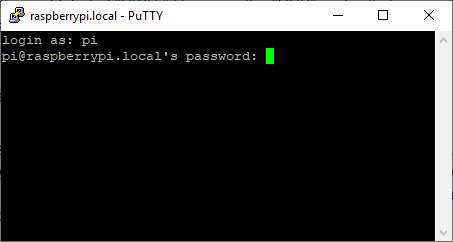</center>

2. Enter raspberrypi or raspberrypi.local as the address you wish to connect to in Putty, and click Open. You usually need to add the .local if the Pi is directly connected to your PC via USB or Ethernet cable.
<center>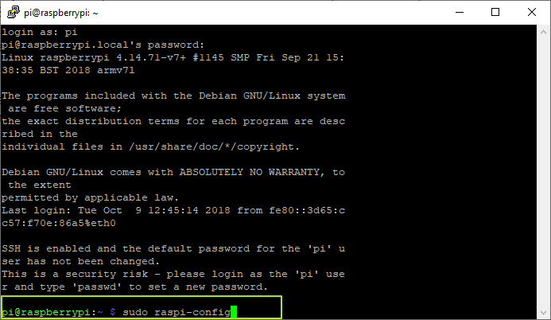</center>

3. Click Ok if you get a security warning alert. It's not a problem.

4. Enter pi as your username and raspberry as your password. You may want to change these later.
<center>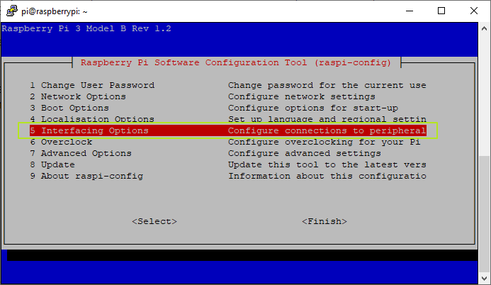</center>
Now you're connected at the command prompt, but if you want to access the GUI, complete with a desktop and floating windows, you'll need to enable VNC.

**Step 6: Enabling and Connecting over VNC**

1. Enter sudo raspi-config at the command prompt.A configuration app opens.
<center>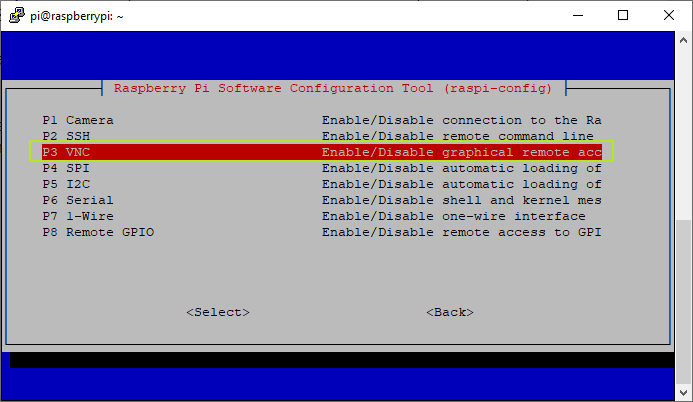</center>
2. Select Interfacing Options (number 5 on the list).
<center>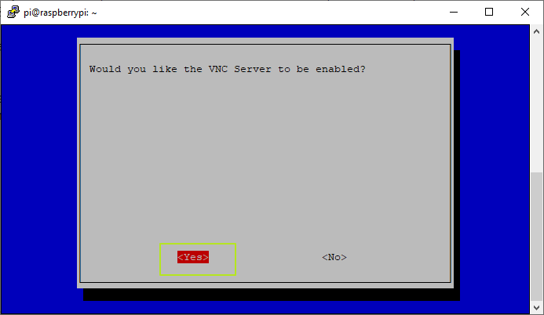</center>
3. Select VNC (number 3 on the menu).
<center>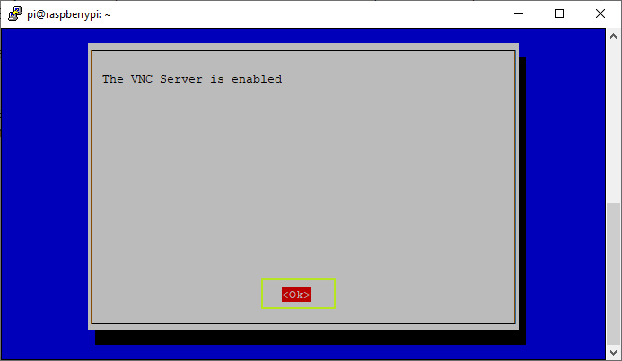</center>
4. Select Yes. 
5. Hit Enter to acknowledge the VNC server is enabled.
6. Select Finish

**On your PC:**

1. Download, install and launch VNC Viewer.
<center>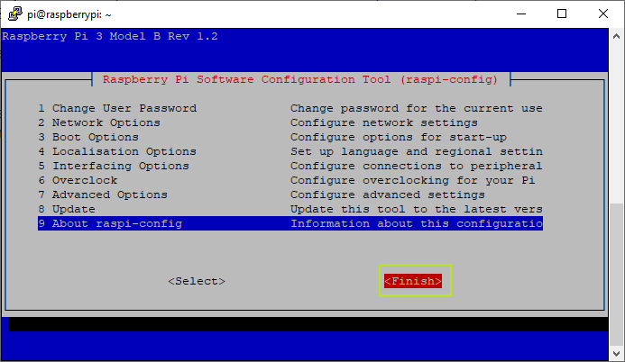</center>

2. Select New connection from the File menu.
<center>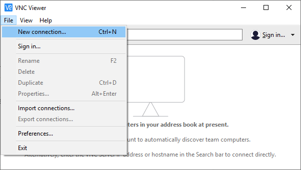</center>

3. Enter raspberry.local in the "VNC Server" field. If this does not work, try again with the name "raspberrypi" without .local.
<center>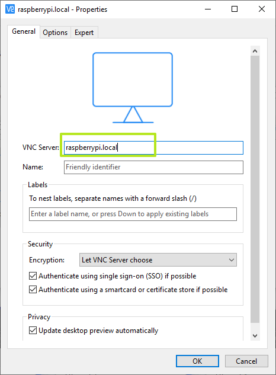</center>

4. Click Ok.
<center>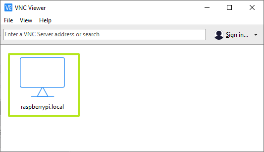</center>

5. Double-click on the connection icon to connect.


6. Click Ok if you are shown a security warning.

7. Enter the Pi's username and password when prompted. The defaults are username: pi and password: raspberry. Click Ok.
<center>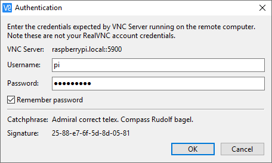</center>

Your Raspberry Pi desktop will then appear in a window on your main computer's desktop. You'll be able to control everything from there.