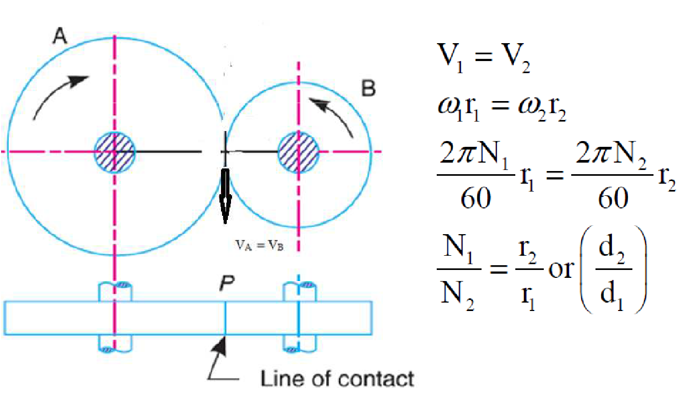
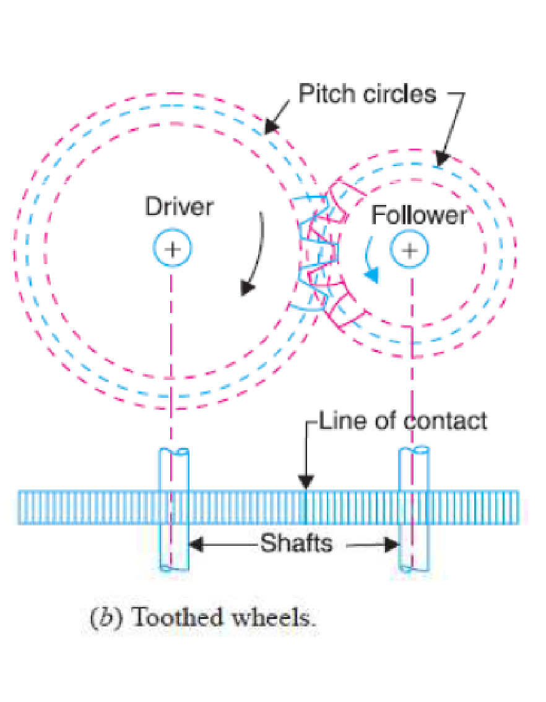
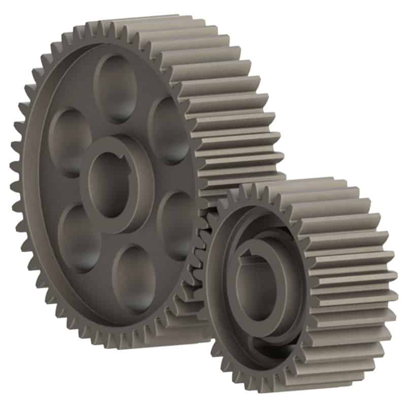
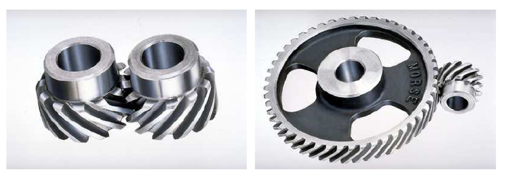
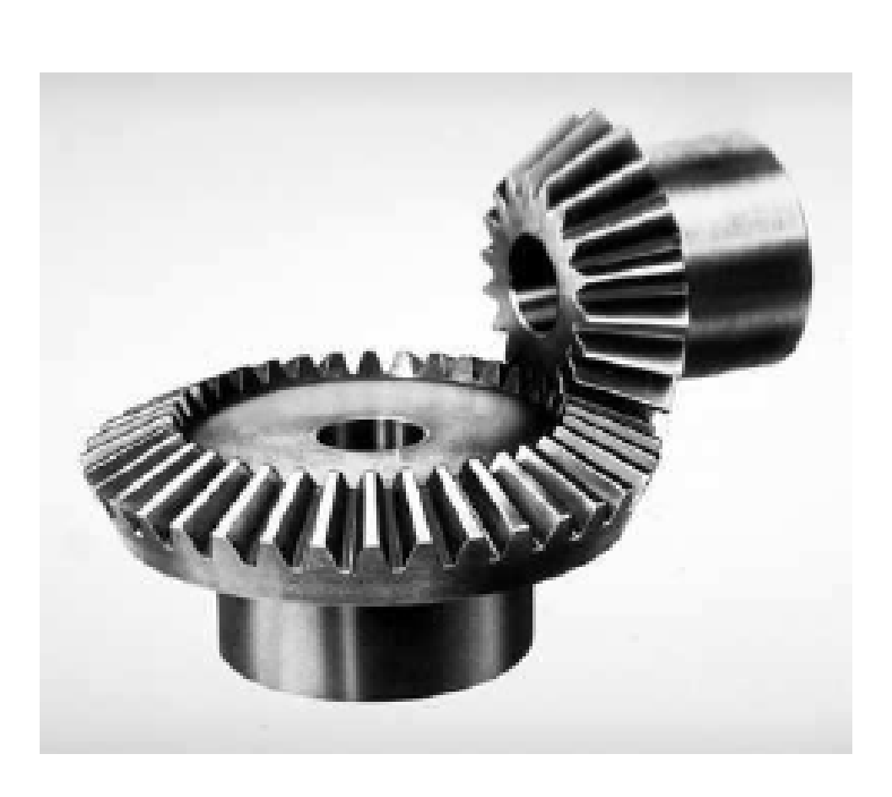
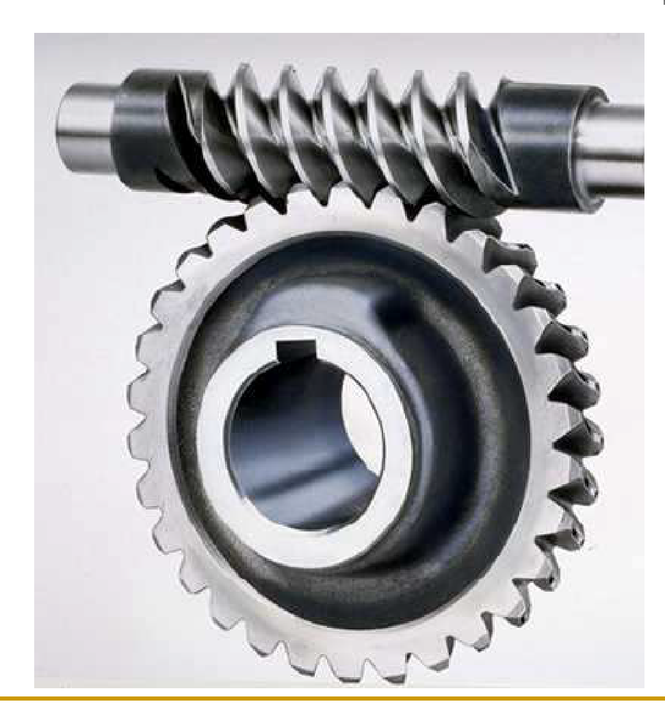
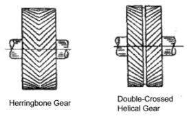
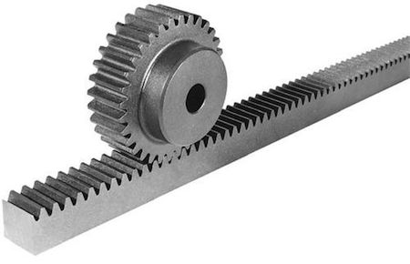
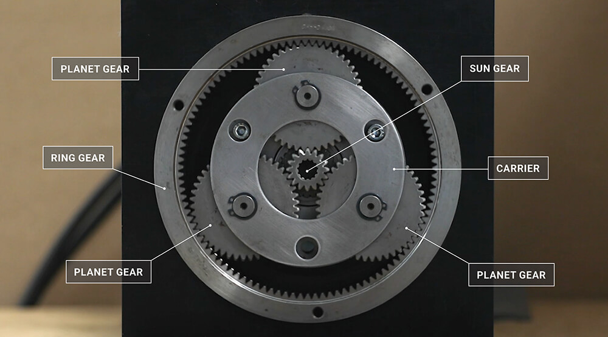

# Gears

## What are Gears?
  
*   Gears are defined as toothed element which are used for transmitting rotary motion from one shaft to another.
*   Gears are most often used in transmissions to convert an electric motor’s high speed and low torque to a shaft’s requirements for low speed high torque.
*   Gears essentially allow positive engagement between Teeth, so high forces can be transmitted while still undergoing essentially rolling contact.
*   Gears do not depend on friction as belt drives and do best when friction is minimized.
*   The motion and power transmitted by gears is kinematically equivalent to that transmitted by friction wheels or discs.

{: style="height:350px"}

_(Transmission of Power)_

*   In order to avoid the slipping, a number of projections (called teeth) as shown in Fig. (b), are provided on the periphery of the wheel A, which will fit into the corresponding recesses on the  periphery of the wheel B. A friction wheel with the teeth cut on it is known as **_toothed wheel or gear._** **_The usual connection to show the toothed wheels is by their pitch circles_**

{: style="height:350px"}

## Advantages and Disadvantages

### Advantages

1.  It transmits exact velocity ratio.
2.  It may be used to transmit large power.
3.  It has high efficiency.
4.  It has reliable service.
5.  It has compact layout.

### Disadvantages

1.  The manufacture of gears require special tools and equipment.
2.  The error in cutting teeth may cause vibrations and noise during operation.

## Types of Gears

*   **According to the position of axes of the shaft**
    *   Parallel: Spur gear, Helical gear, Rack and Pinion
    *   Intersecting: Bevel Gear
    *   Non Intersecting and Non Parallel: Worm and Worm Gears

*   **According to the periphery velocity**
    *   Low Velocity
    *   Medium Velocity
    *   High Velocity

*   **According to the type of gearing**
    *   External Gearing
    *   Internal Gearing
    *   Rack and Pinion

*   **According to the position of teeth on surface**
    *   Straight
    *   Inclined
    *   Curved

## Spur Gear

Spur gears are a type of cylindrical gear, with shafts that are parallel and coplanar, and teeth that are straight and oriented parallel to the shafts. They’re arguably the simplest and most common type of gear – easy to manufacture and suitable for a wide range of applications.

{: style="height:350px"}

The teeth of a spur gear have an involute profile and mesh one tooth at a time. The involute form means that spur gears only produce radial forces (no axial forces), but the method of tooth meshing causes high stress on the gear teeth and high noise production. Because of this, spur gears are typically used for lower speed applications, although they can be used at almost any speed.

Spur gears are generally seen as best for applications that require speed reduction and torque multiplication, such as ball mills and crushing equipment. Examples of high-speed applications that use spur gears – despite their high noise levels – include consumer appliances such as washing machines and blenders. And while noise limits the use of spur gears in passenger automobiles, they are often used in aircraft engines, trains, and even bicycles.

## Helical Gear

The teeth of a helical gear are set at an angle (relative to axis of the gear) and take the shape of a helix. This allows the teeth to mesh gradually, starting as point contact and developing into line contact as engagement progresses.

One of the most noticeable benefits of helical gears over spur gears is less noise, especially at medium- to high-speeds. Also, with helical gears, multiple teeth are always in mesh, which means less load on each individual tooth. This results in a smoother transition of forces from one tooth to the next, so that vibrations, shock loads, and wear are reduced. One interesting thing about helical gears is that if the angles of the gear teeth are correct, they can be mounted on perpendicular shafts, adjusting the rotation angle by 90 degrees.

Helical gears are often the default choice in applications that are suitable for spur gears but have non-parallel shafts. They are also used in applications that require high speeds or high loading. And regardless of the load or speed, they generally provide smoother, quieter operation than spur gears.

## Bevel Gear

Bevel gears are gears where the axes of the two shafts intersect and the tooth-bearing faces of the gears themselves are conically shaped. Bevel gears are most often mounted on shafts that are 90 degrees apart, but can be designed to work at other angles as well. The pitch surface of bevel gears is a cone.

{: style="height:350px"}

There are several types of bevel gears based on the shape of their teeth.

*   **Straight**
    *   They have conical pitch surface and teeth are straight and tapering towards apex.
    *   They are useful to verify the transmission of the motion that is generated between axes that intersect within one same plane, almost always at a 90-degree angle.
    *   Straight bevel gears have many uses in watches, dentist drills, hand drills and vending machines.

*   **Spiral**
    *   They have curved teeth at an angle allowing tooth contact to be gradual and smooth and operate at very steep planes.
    *   Spiral bevel gears provide a high level of control over the way in which teeth mesh, and their design allows for certain mounting deflections without excessively increasing the load on either end of the teeth.
    *   They can be used at high speeds, and are usually employed in motorcycle and bicycle gears.

*   **Hypoid**
    *   These are similar to spiral bevel, but the pitch surfaces are hyberbolic and not conical. The pinion can be offset above or below the gear center, thus allowing larger pinion diameter, longer life, and smoother mesh.
    *   In addition to being used in industrial machinery, they are commonly used in the automotive industry, where it is used in rear-wheel drive vehicles to connect the driveshaft with the wheels.

## Worm Gears

Worm gears are constructed of a worm and a gear (sometimes referred to as a worm wheel), with non-parallel, non-intersecting shafts oriented 90 degrees to each other. The worm is analogous to a screw with a V-type thread, and the gear is analogous to a spur gear. The worm is typically the driving component, with the worm’s thread advancing the teeth of the gear.

{: style="height:350px"}

The primary benefit of worm gears is their ability to provide high reduction ratios (like 20:1 and even up to 300:1 or greater) and correspondingly high torque multiplication. They can also be used as speed reducers in low- to medium-speed applications. And, because their reduction ratio is based on the number of gear teeth alone, they are more compact than other types of gears. Worm gears are used widely in material handling and transportation machinery, machine tools, automobiles etc.

## Herringbone Gear

The herringbone gear consists of two sets of gear teeth on the same gear, one right hand and one left hand. Having both hands of gear teeth, causes the thrust of one set to cancel out the thrust of the other. It is used for transmitting power between parallel shafts. It was developed to overcome the disadvantage of the high-end thrust that is present with single-helical gears. Also another advantage of this gear type is quiet, smooth operation at higher speeds. They are mostly used on heavy machinery.

## Rack and Pinion

A rack and pinion drive system consists of a rack (or a “linear gear”) and a pinion (or “circular gear”), which operate to convert rotational motion into linear motion. A rack and pinion drive can use both straight and helical gears. These systems provide high-speed travel over extremely long lengths and are frequently used in large gantry systems for material handling, machining, welding and assembly, especially in the automotive, machine tool, and packaging industries.

## Planetary Gear

A planetary gear set is made up of three types of gears; a sun gear, planet gears, and a ring gear. The sun gear is located at the center, and transmits torque to the planet gears which are typically mounted on a moveable carrier. The planet gears orbit around the sun gear and mesh with an outer ring gear. Planetary gear systems can vary in complexity from very simple to intricate compound systems, depending on the application.

{: style="height:250px"}

Planetary gear systems are able to produce a lot of torque because the load is shared among multiple planet gears. This arrangement also creates more contact surfaces and a larger contact area between the gears than a traditional parallel axis gear system. Because of this, in the load is more evenly distributed and therefore the gears are more resistant to damage.

Planetary gears are often used when space and weight are an issue, but a large amount of speed reduction and torque are needed. This requirement applies to a variety of industries, including tractors and construction equipment where a large amount of torque is needed to drive the wheels. Other places you will find planetary gear sets include turbine engines, automatic transmissions, and even electric screwdrivers.